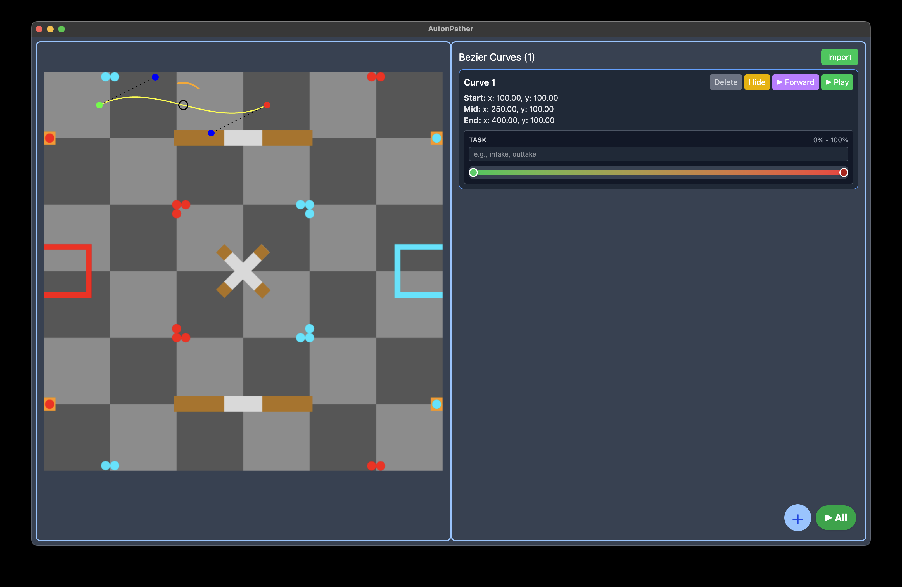
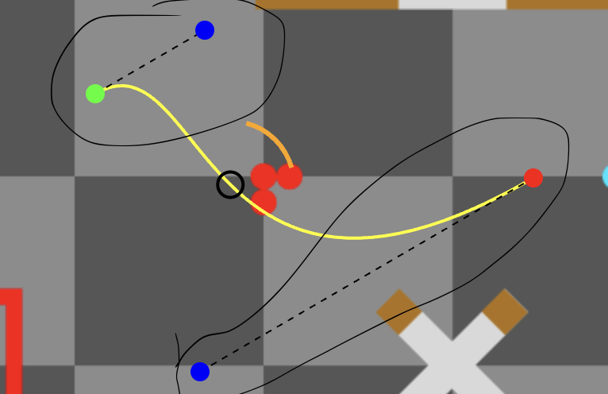
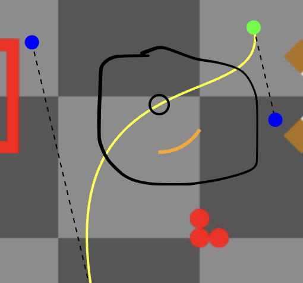
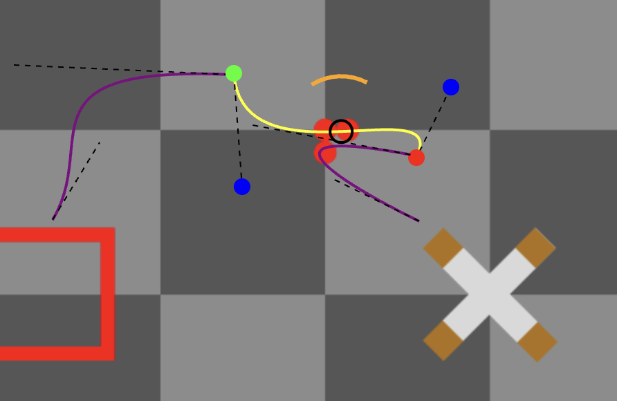
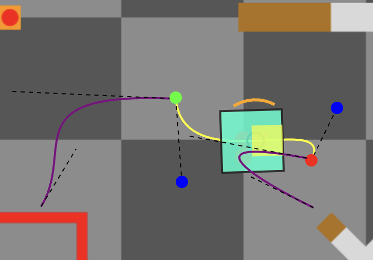
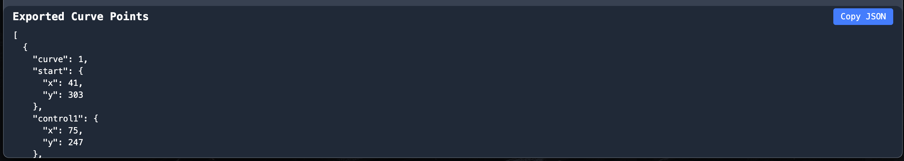
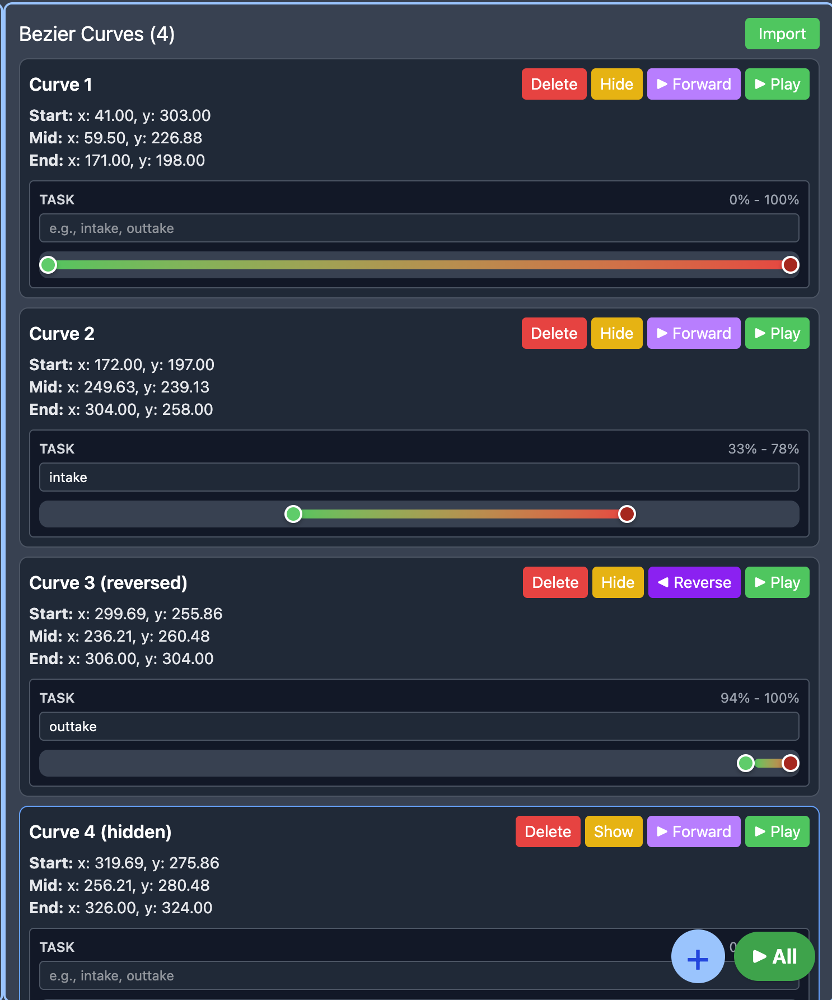
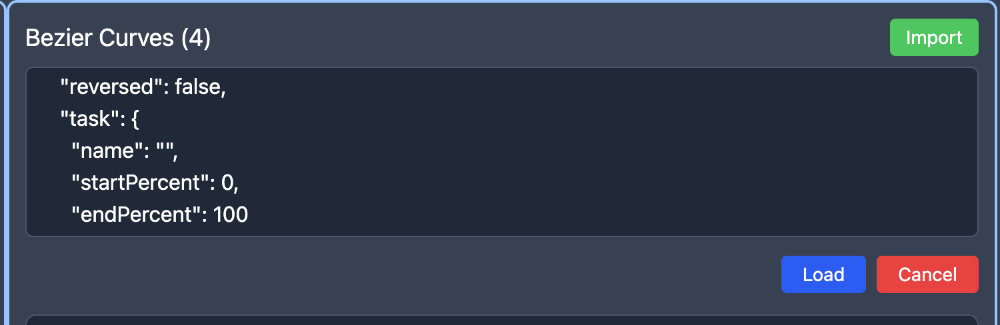

# Robotics Club BLACKOUT 25-26 - Code Notebook

## Table of Contents
- [Overview](#overview)
- [Planning](#planning)
- [Flowcharts](#flowcharts)
- [Pseudocode](#pseudocode)
- [Global Variables & Structure](#global-variables--structure)
- [Driver Control](#driver-control)
- [Autonomous Control](#auton-control)
- [Autonomous Pather](#auton-pather)

---

## Overview
This notebook documents the codebase for the Robotics Club BLACKOUT project (2025-26 season). Each section breaks down the technical implementation, function flow, and code structure.

---

## Planning

### Framework

First we had to decide what framework we wanted to use. We talked about everyone's experience and decided on a few option: PROS, Vexide, and V5 robot C. We listed off the pros and cons for these frameworks to decide which one.

- PROS
  - Pros
    - Everyone has experience
    - Good development experience
    - Raw C++ files
    - High community support
  - Cons
    - Limited outside library integration
- Vexide
  - Pros
    - Super high control
    - Amazing developer experince
    - Good outside library integration
  - Cons
    - Not everyone knows it
    - Rust can be difficult at times
    - Newer, so less community support
- V5 Robot C
  - Pros
    - Very high vex support
    - Easy to read
  - Cons
    - Not everyone has experience
    - Custom programming language
    - Very slow compile times

We decided to use the PROS framework due to the good development experience and everyone's experience.

### Programming Style

We then had to decide what programming structure to use. It's important to define this in the beginning so everyone has the same idea of what's being made and how it needs to be made. There's a few key ones to look at, mainly Object Oriented Progamming (OOP) or Functional Programming.

Object Oriented Programming (OOP): Is saying that we can create reusable classes that abstarct data from the user and worry about the implementation just inside the class and little to no work outside the class. This allows for central parts of the codebase to only be where it needs to be. It also means if one thing is changed then all things are changed.

Functional Programming: This says that if there is a function on the robot, then there must be a function created in the codebase. Like if there is the intake, we should create an intake function that handles the function of the intake.

We then created a pros and cons list to help make the decision:

- OOP
  - Pros
    - Organized
    - Abstracted usage
    - Chnage code in one spot to change everywhere
    - Easy maintaince
  - Cons
    - Harder to setup
    - Must define good structure
- Functional
  - Pros
    - Faster development
    - Easier to define structure
  - Cons
    - Can lead to messy code
    - Having to manage a ton of global variables
  
We decided to go with OOP as we felt even though it took longer setup, in the end it would definitely be worth it once we want to make changes.

---

## Flowcharts

---

## Pseudocode

### robot.cpp

#### Summary
The robot file actually has no implementation inside of it. The robot file simply holds every componeent of the robot. You can think of the robot file as an actual robot. The physical robot is not what actually does everything, but rather all the componenets working together makes the robot work. Robot.cpp should define the global instances of every componenet of the robot for all other functions to use. This will allow for super easy future development and changes as everything is all defined in one place.

#### Code Structure
```
/*
// ----------------------------------------------------------------------------
// Robot: holds composed subsystems and provides a single access point
// ----------------------------------------------------------------------------
class Robot {
public:
    Robot(Drivetrain& dt, Odometry& od, Intake& in, Pneumatics& pn)
        : drivetrain(dt), odometry(od), intake(in), pneumatics(pn) {}

    Drivetrain& drivetrain;
    Odometry& odometry;
    Intake& intake;
    Pneumatics& pneumatics;
};

// Global accessor to a single robot instance backed by existing globals
Robot& getRobot();
*/
```

---

### drivetrain.cpp

#### Summary
Drivetrain needs to hold all the implementation for making the robot move, this includes both functions for opcontrol and autonomous. This also gave us a chance to define all of the functions we would need for this class. We definend them each into sections as you can see in the code below: Dirver control modes, defines all drive schemes and our custom cubic acceleration curve; Configuration and Low Level Control are both full of helper function that PROS already implements for us; Sensors, exposes the sensors we use like motor positions and the builtin motor temperature sensors; and finally, Motion Primitives, these are raw movement methods that are very basic and just check within ticks.

#### Code Structure
```
/*
================================================================================
DRIVETRAIN OOP - PSEUDOCODE
================================================================================

DRIVER CONTROL MODES
--------------------

void tank(leftY, rightY):
    // Classic tank drive - left stick controls left, right stick controls right
    if curved mode enabled:
        apply cubic curve to leftY
        apply cubic curve to rightY
    move left motors at leftY
    move right motors at rightY

void split(power, turn):
    // Split arcade - forward/back on one stick, turn on another
    calculate left = power + turn
    calculate right = power - turn
    if curved mode enabled:
        apply cubic curve to left
        apply cubic curve to right
    move left motors at left
    move right motors at right

void arcade(power, turn):
    // Single-stick arcade - Y for forward/back, X for turn
    calculate left = power + turn
    calculate right = power - turn
    if curved mode enabled:
        apply cubic curve to left
        apply cubic curve to right
    move left motors at left
    move right motors at right

static int cubicCurve(v):
    // Apply cubic input shaping for smoother control
    return (v * v * v) / (127 * 127)
    // Small inputs become smaller, max ±127 stays at ±127


LOW-LEVEL CONTROL
-----------------

void setOpenLoop(left, right):
    // Direct motor control with velocity [-127, 127]
    clamp left to range [-127, 127]
    clamp right to range [-127, 127]
    move left motors at left
    move right motors at right

void setVoltage(leftMv, rightMv):
    // Direct voltage control in millivolts [-12000, 12000]
    clamp leftMv to range [-12000, 12000]
    clamp rightMv to range [-12000, 12000]
    apply leftMv to left motors
    apply rightMv to right motors

void tare():
    // Reset all motor encoders to zero
    reset position of all motors to 0

void brake():
    // Stop and brake all motors
    brake left motors
    brake right motors


CONFIGURATION
-------------

void setBrakeMode(mode):
    // Set brake behavior (COAST/BRAKE/HOLD)
    set left motors to mode
    set right motors to mode
    set all motors to mode

void setEncoderUnits(units):
    // Configure encoder measurement (DEGREES/ROTATIONS/COUNTS)
    set left motors to units
    set right motors to units


SENSORS
-------

void getPosition(leftTicks, rightTicks):
    // Read current encoder positions
    read left motors position → leftTicks
    read right motors position → rightTicks

vector<double> getTemperatures():
    // Read all motor temperatures
    query all motors for temperature
    return vector of temperatures


MOTION PRIMITIVES (Blocking)
-----------------------------

void move(distInches, velocity):
    // Move straight forward/backward by distance
    reset all motor encoders to 0
    ticks = distInches / distPerTick
    command all motors to move ticks at velocity
    while not within ±5 ticks of target:
        check current position
        delay 2ms
    brake all motors
    delay 150ms

void turn(thetaDeg, velocity):
    // Turn in place by angle
    reset left and right encoders to 0
    arcDistance = (thetaDeg / 360) * π * wheelBase
    ticks = arcDistance / distPerTick
    right motors move -ticks  // backward
    left motors move +ticks   // forward
    while not within ±5 ticks on both sides:
        check left and right positions
        delay 2ms
    brake both sides
    delay 150ms

================================================================================
*/
```

---

### intake.cpp

#### Summary
The intake file needs to be able to move all the motors involved with the intake. This involves both opcontorl and autonomous. We definend what functions we would need to implement for the intake class. We definend all methods into different categories: Driver Control, this function is for using the bumpers in order to be able to move the intake for both intaking, outtaking, but also moving up to different stages in the intake; Manual Control and Configuration and Testing, these functions are all already implemented in PROS; Autonomous Helpers, this allows us to run the intake for a certain amount of time in seconds; Finally Legacy Wrapper, this allows us to have easy names and use reuse some old code for easier development.

#### Code Structure
```
/*
================================================================================
INTAKE - PSEUDOCODE
================================================================================

PURPOSE: Control intake motors for picking up and ejecting game pieces
         (rings/triballs) during both driver control and autonomous periods

CLASS: Intake
DEPENDENCIES: pros::MotorGroup (motors_), pros::Controller (controller_)

================================================================================

DRIVER CONTROL
--------------

void teleopControl():
    // Button-based intake control during driver period
    if R1 button pressed:
        run motors at -127 (reverse/outtake)
    else if R2 button pressed:
        run motors at 127 (forward/intake)
    else:
        stop motors (0 power)
    // R1 = outtake, R2 = intake, neither = stop


MANUAL CONTROL
--------------

void run(power):
    // Direct power control for intake motors
    clamp power to range [-127, 127]
    move motors at power
    // Positive = intake, negative = outtake


AUTONOMOUS HELPERS
------------------

void autonRunSeconds(seconds):
    // Timed intake for autonomous - runs for fixed duration
    run motors at 75 power
    wait (seconds * 1000) milliseconds
    stop motors (0 power)
    delay 100ms for settling


CONFIGURATION & TESTING
------------------------

void tare():
    // Reset intake encoder positions to zero
    reset motor positions to 0

void setVoltage(mV):
    // Direct voltage control in millivolts
    apply mV to motors

int getPosition():
    // Read current encoder position
    return motor position

void setBrakeMode(mode):
    // Set brake behavior (COAST/BRAKE/HOLD)
    set all motors to mode


LEGACY WRAPPERS (For Compatibility)
------------------------------------

void intake():
    // Global function wrapper for teleopControl
    call getRobot().intake.teleopControl()

void autonIntake(time):
    // Global function wrapper for autonomous intake
    call getRobot().intake.autonRunSeconds(time)

================================================================================
*/
```

---

### pneumatics.cpp

#### Summary
The pneumatics file should define all methods use to contorl the pneumatics system. This includes any functions involved in both opcontrol and autonomous. For pneumatics, we defined HIGH (meaning it's filled with air) as the extended state while LOW (no air in the pump) as the non-extended state. We definend the code into a few sections: Driver Control, we definend a simple toggle method hear that allows us to press one button and turn the pneumatic on or off, it also includes a 200ms delay for a "debounce" which allows us to press the button and only toggle the pneumatic once as humans need time to release the button; Autonomous Control, this allows us to just choose which state we want instead of having to remember which toggle we're on; Legacy Wrappers, this allows for us to reuse old code and have easier names to rememeber to actually call the functions.

#### Code Structure
```
/*
================================================================================
PNEUMATICS - PSEUDOCODE
================================================================================

PURPOSE: Control pneumatic actuators (cylinders/pistons) for mechanisms like
         clamps, wings, or other binary (on/off) systems using digital ports

CLASS: Pneumatics
DEPENDENCIES: pros::Controller (controller_), pros::adi::Port (digital ports)

================================================================================

DRIVER CONTROL
--------------

bool toggle(state, button, pin):
    // Toggle pneumatic state when button is pressed
    // Returns new state for tracking in calling code
    if button is pressed:
        if current state is HIGH (extended):
            set pin to LOW (retract)
            display "ON" on controller screen
            delay 200ms (debounce)
            return LOW
        else if current state is LOW (retracted):
            set pin to HIGH (extend)
            display "OFF" on controller screen
            delay 200ms (debounce)
            return HIGH
    return state (no change if button not pressed)
    
    // Usage: clampState = toggle(clampState, L1, clampPin)


AUTONOMOUS CONTROL
------------------

void set(state, pin):
    // Directly set pneumatic state during autonomous
    // No button checking, immediate response
    set pin to state (HIGH or LOW)
    delay 150ms (allow pneumatic to actuate)
    
    // Usage: set(HIGH, clampPin) to extend clamp


LEGACY WRAPPERS (For Compatibility)
------------------------------------

bool switchState(state, button, pin):
    // Global function wrapper for toggle
    call getRobot().pneumatics.toggle(state, button, pin)
    return new state

void setAutonPin(state, pin):
    // Global function wrapper for autonomous control
    call getRobot().pneumatics.set(state, pin)

================================================================================
NOTES:
- HIGH = pneumatic extended (typically grabs/engages)
- LOW = pneumatic retracted (typically releases/disengages)
- 200ms debounce prevents rapid toggling from single button press
- Controller text shows current state for driver feedback
- Pin parameter passed by reference to modify actual hardware port
================================================================================
*/
```

---

### pid.cpp

#### Summary
pid.cpp will be one of the most important files made due to how much it will be used during autonomous. The PID file should hold all functions related to PID which includes both linear and angular PID. PID is simply a "controller" that programmers can use to ensure the both does a task both accurately and speedly while being resistant to outside changes. PID can measure how far you are from completition and adjust itself based off of that. PID is simply definend as the equation below:

The equation looks scary but is actually pretty simple. What it's saying is that the equation takes 3 things into consideration when outputting:  
  1.) How far are we from the target?  
  2.) How much error have we accumalated through the whole task?  
  3.) How fast are we approaching our tagret?  
Implementing this into our code is much more approachable then solving the equation using calculas. Another big part of the equation though is kP, kI, and kD. These are constants that we define and is want people refer to when they say they are "tuning" PID. By adjusting the three constants we can define how want our PID to weigh certain actions. For example, we could have a large kP which means the robot will push out a lot of power when we far from the target. PID is essential to the robot so we made sure to properly plan this out. We definend some pseudocode into different sections which inlcudes: PID tuning constants, defines all of the kP, kI, kD for both linear and angular PID; We then broke into the actual PID contorller sections, one for both linear and angular; and finally, Helper Functions, this includes degree and radian conversions, updating odometry, and getting erros from callig methods from drivetrain.
#### Code Structure
```
/*
================================================================================
PID CONTROLLER - PSEUDOCODE
================================================================================

PURPOSE: Closed-loop control for accurate linear (straight) and angular (turn)
         movements using PID (Proportional-Integral-Derivative) algorithm

SENSORS:
- Linear: Rotation sensor on port 1 (2-inch tracking wheel)
- Angular: IMU sensor on port 5 (gyroscope)

CONTROL OUTPUT: Motor voltage in millivolts [-12000, 12000]

================================================================================

PID TUNING CONSTANTS
--------------------

Linear PID (linPID):
    kP = 500   // Proportional: main driving force (500 × 24" = 12000mV)
    kI = 5     // Integral: eliminates steady-state error
    kD = 80    // Derivative: dampens oscillation and overshoot
    timeout = 3 seconds

Angular PID (angPID):
    kP = 275   // Proportional: turn rate
    kI = 150   // Integral: corrects persistent angle error
    kD = 50    // Derivative: reduces overshoot in turns
    timeout = 3 seconds

================================================================================

LINEAR PID - STRAIGHT LINE MOVEMENT
------------------------------------

void linearPID(target):
    // Move robot straight to target distance using tracking wheel
    
    INITIALIZATION:
        reset rotation sensor position to 0
        reset PID state (error, prevError, integral) to 0
        start timer
        set firstIteration flag to true
        delay 10ms for clean first reading
    
    CONTROL LOOP (runs at 100Hz):
        READ SENSOR:
            get sensor angle in centidegrees
            convert to degrees (centidegrees / 100)
            calculate distance = (angle / 360) × wheel circumference
            // 2-inch wheel circumference = π × 2 ≈ 6.283 inches
        
        CALCULATE ERROR:
            error = target - distance traveled
            // Positive error = need to go forward
            // Negative error = need to go backward
        
        CHECK EXIT CONDITIONS:
            if time >= 3 seconds:
                timeout, break loop
            if |error| < 0.5 inches:
                target reached, break loop
        
        COMPUTE DERIVATIVE:
            if first iteration or dt < 0.001:
                derivative = 0  // prevent spike
            else:
                derivative = (error - prevError) / dt
        
        ACCUMULATE INTEGRAL:
            integral += error × dt
            clamp integral to [-800, 800]  // prevent windup
        
        CALCULATE OUTPUT:
            power = (500 × error) + (5 × integral) + (80 × derivative)
            
            if |error| > 3 inches AND |power| < 1500mV:
                apply minimum 1500mV  // overcome static friction
            
            clamp power to [-12000, 12000] millivolts
        
        APPLY POWER:
            set both left and right motors to power
        
        UPDATE STATE:
            prevError = error
            delay 10ms
    
    CLEANUP:
        brake motors
        delay 100ms for complete stop

EXAMPLE: linearPID(24)
    - Starts at max power (12000mV) when 24" away
    - Gradually reduces as distance closes
    - Arrives smoothly within 0.5" of target

================================================================================

ANGULAR PID - TURNING IN PLACE
-------------------------------

void angularPID(target):
    // Turn robot to target heading using IMU
    
    INITIALIZATION:
        reset IMU heading to 0 degrees
        reset PID state (error, prevError, integral) to 0
        start timer
        set firstIteration flag to true
    
    CONTROL LOOP (runs at 100Hz):
        READ SENSOR:
            get current heading from IMU (0-360 degrees)
        
        CALCULATE ERROR:
            error = target - currentHeading
            
            normalize to shortest path [-180, 180]:
                while error > 180: error -= 360
                while error < -180: error += 360
            // Example: target=10°, current=350° → error=20° (turn right)
        
        CHECK EXIT CONDITIONS:
            if time >= 3 seconds:
                timeout, break loop
            if |error| < 1.0 degrees:
                target reached, break loop
        
        COMPUTE DERIVATIVE:
            if first iteration or dt < 0.001:
                derivative = 0  // prevent spike
            else:
                derivative = (error - prevError) / dt
        
        ACCUMULATE INTEGRAL:
            integral += error × dt
            clamp integral to [-12000, 12000]  // prevent windup
        
        CALCULATE OUTPUT:
            power = (275 × error) + (150 × integral) + (50 × derivative)
            
            if |power| < 1500mV:
                apply minimum 1500mV  // overcome static friction
            
            clamp power to [-12000, 12000] millivolts
        
        APPLY POWER:
            left motors: +power (forward)
            right motors: -power (backward)
            // Differential steering for in-place turn
        
        UPDATE STATE:
            prevError = error
            delay 10ms
    
    CLEANUP:
        brake motors
        delay 100ms for complete stop

EXAMPLE: angularPID(90)
    - IMU reads 0°, target 90°
    - Error = 90°, applies strong right turn
    - Reduces power as angle approaches 90°
    - Stops within 1° of target

================================================================================

HELPER FUNCTIONS
----------------

double getLinearError(target, leftTicks, rightTicks):
    // Calculate linear distance error (legacy, not used with rotation sensor)
    update odometry with encoder ticks
    average = (leftTicks + rightTicks) / 2 × distOneTick
    return target - average

double getAngularError(target, leftTicks, rightTicks):
    // Calculate angular error (legacy, not used with IMU)
    update odometry with encoder ticks
    error = target - globalHeading
    normalize to [-180, 180]
    return error

void updateOdom(leftTicks, rightTicks):
    // Update global odometry position
    delegate to getRobot().odometry.update(leftTicks, rightTicks)
    // Mirrors position to globalPos[] and globalHeading

double degToRad(deg):
    return deg × (π / 180)

double radToDeg(rad):
    return rad × (180 / π)

================================================================================

PID CONTROL THEORY
------------------

PROPORTIONAL (P):
    - Reacts to current error magnitude
    - Larger error → more power
    - Problem: can never quite reach zero (steady-state error)

INTEGRAL (I):
    - Accumulates error over time
    - Eliminates steady-state error
    - Problem: can cause overshoot (integral windup)
    - Solution: clamp integral to reasonable bounds

DERIVATIVE (D):
    - Reacts to rate of change of error
    - Predicts future error trend
    - Dampens oscillation and overshoot
    - Problem: sensitive to noise
    - Solution: skip first iteration, check dt validity

COMBINED (PID):
    output = kP×error + kI×∫error dt + kD×(d error/dt)
    
    - P gets you close quickly
    - I eliminates remaining error
    - D prevents overshooting

================================================================================
*/
```

---

### odometry.cpp

#### Summary
odometry.cpp needs to hold all the code involved with tracking where the robot is. Odometry is really just a simple version of GPS. It allows us to know at all times where the robot is by using various methods of tracking. When building out the pseudocode we made it into a few different sections: Initialization, this is very important for odometry as the initial setup with setting correct position, intializing all sensors, etc; Position Management, right now the only method we found we needed was reseting our position; another section is Position Tracking, this has the main update function which gets called constantly to ensure the robots position is being constantly updated, essentially what happens is we calculate distance based off the current motor positions based off the past reading, we then read the heading based off the IMU on the bot, with all this information we can create triangles to then find out our exact position on the bot.
#### Code Structure
```
/*
================================================================================
ODOMETRY - PSEUDOCODE
================================================================================
Purpose: Track robot's position (x, y) and heading (theta) on the field
Sensors: IMU for absolute heading, motor encoders for distance traveled
Method: Differential drive odometry with IMU integration

INITIALIZATION
--------------

Odometry(imuRef, wheelBaseIn, distPerTickIn):
    // Constructor - set up odometry with sensors and calibration
    store reference to IMU sensor
    store wheelBase (distance between left/right wheels in inches)
    store distPerTick (inches traveled per encoder tick)
    call reset(0, 0, 0) to initialize position at origin


POSITION MANAGEMENT
-------------------

void reset(x, y, thetaDeg):
    // Set robot to known position and heading (used at autonomous start)
    set current x position = x
    set current y position = y
    normalize thetaDeg to [-180, 180] and store as current heading
    reset lastLeftTicks to 0
    reset lastRightTicks to 0
    // After this, odometry tracking starts from the new position


POSITION TRACKING (MAIN LOOP)
------------------------------

void update(leftTicks, rightTicks):
    // Call this repeatedly (e.g., every 10ms) to track robot movement
    
    // Step 1: Calculate distance traveled since last update
    calculate dLeft = leftTicks - lastLeftTicks
    calculate dRight = rightTicks - lastRightTicks
    store leftTicks as lastLeftTicks
    store rightTicks as lastRightTicks
    
    // Step 2: Convert encoder ticks to actual distance in inches
    calculate distLeft = dLeft × distPerTick
    calculate distRight = dRight × distPerTick
    calculate distAvg = (distLeft + distRight) / 2
    // distAvg is the straight-line distance the robot's center moved
    
    // Step 3: Get current heading from IMU
    read IMU heading and normalize to [-180, 180] degrees
    store as current thetaDeg
    convert current thetaDeg to radians for math calculations
    
    // Step 4: Update position using heading and distance traveled
    add distAvg × cos(heading) to current x position
    add distAvg × sin(heading) to current y position
    
    // Step 5: Mirror to legacy global variables for backward compatibility
    copy current thetaDeg to globalHeading
    copy current x to globalPos[0]
    copy current y to globalPos[1]


================================================================================
NOTES
================================================================================
- Differential drive odometry uses encoder deltas to estimate distance
- IMU provides absolute heading (corrects for wheel slip in turns)
- Call update() at high rate (100Hz) for best accuracy
- Position drift accumulates over time - reset to known positions periodically

Example Usage:
    getRobot().odometry.reset(6.0, 6.0, 0.0);  // Start at (6", 6")
    
    // In loop:
    getRobot().odometry.update(leftEncoder, rightEncoder);
    Pose2D pose = getRobot().odometry.pose();

================================================================================
*/
```

---

### pathFollower.cpp

#### Summary
The pathfollower file holds all methods involved in moving the robot based off the auton paths provided. The pathfollower combines everything while also adding more functionality. It uses drivetrain, odometry, pid, but also new methods like bezier curves and pure pursuit. This was a very large task for our team as it involves a lot of seperate things and very complex concepts. One of the largest tasks was definitely pure pursuit. Pure pursuit is a way for the robot to calculate the path it should take if the path involves a turn. With no pure pursuit, the robot woul have to move straight, turn, then move straight again. Instead, the robot can calculate that we can take a constant turn and move along a constant path with rounded corners instead of taking sharp turns. When making the pseudocode, we made sure to be very detailed and plan it out carefully. We split all our methods into a few different groups: Bezier Curve, the first method is the smaple at method which allows us to get a bunch of points along the bezier curve, we then also use the get tangent line which allows us to find the target heading, finally we also use a convert to inches from pixels method to convert from auton pather to robot coords; Next we created the Path Class, this holds all code for dealing with the paths created from the pather, frist method we made was one that loads the path from the json (image below):  

#### Code Structure
```
/*
================================================================================
PATH FOLLOWER - PSEUDOCODE
================================================================================
Purpose: Pure Pursuit path following using Bezier curves for smooth autonomous
Method: Generate waypoints from curves, track closest point, follow lookahead
Coordinate System: Field-centric (x, y) in inches, heading in degrees

BEZIER CURVE CLASS
-------------------

Point sampleAt(t):
    // Get point on curve at parameter t [0, 1]
    // Uses composite quadratic Bezier (5 control points split into 2 curves)
    if t <= 0.5:
        use first half: start → control1 → middle
        remap t to [0, 1] for local calculation
        calculate quadratic Bezier formula
    else:
        use second half: middle → control2 → end
        remap t to [0, 1] for local calculation
        calculate quadratic Bezier formula
    return point (x, y)

double getTangentAt(t):
    // Get heading/direction of curve at parameter t
    sample point slightly before t
    sample point slightly after t
    calculate angle between the two points using atan2
    convert radians to degrees
    return tangent angle

void convertToInches():
    // Convert all control points from pixels to inches
    multiply all x coordinates by PIXELS_TO_INCHES
    multiply all y coordinates by PIXELS_TO_INCHES


PATH CLASS
----------

void loadFromJSON():
    // Load path curves (hardcoded for now, will load from JSON file later)
    reset curveCount to 0
    create curve 1 with control points
    set curve properties (curve number, reversed flag)
    convert curve to inches
    add curve to curves array
    increment curveCount
    // Repeat for additional curves (currently commented out)

void generateWaypoints(pointsPerCurve):
    // Sample each curve to create discrete waypoints for following
    reset waypointCount to 0
    for each curve in path:
        for i from 0 to pointsPerCurve:
            calculate t = i / pointsPerCurve (parameter [0, 1])
            sample point at t from curve
            add point to waypoints array
            increment waypointCount
    print number of waypoints generated

int getClosestPointIndex(currentPos):
    // Find waypoint closest to robot's current position
    if no waypoints exist:
        return -1
    set closestIndex to 0
    calculate minDistance to first waypoint
    for each remaining waypoint:
        calculate distance to currentPos
        if distance < minDistance:
            update minDistance
            update closestIndex
    return closestIndex

Point getLookaheadPoint(currentPos, closestIndex, lookaheadDist):
    // Find point ahead on path at lookahead distance
    if no waypoints or invalid closestIndex:
        return currentPos
    search forward from closestIndex:
        calculate distance from currentPos to waypoint
        if distance >= lookaheadDist:
            return that waypoint
    if no point found at lookahead distance:
        return last waypoint (end of path)


PURE PURSUIT CONTROLLER CLASS
------------------------------

PurePursuitController():
    // Constructor - initialize controller
    set currentPath to null
    set lastClosestIndex to 0

void setPath(path):
    // Assign path to follow
    store path pointer
    reset lastClosestIndex to 0

void setConfig(cfg):
    // Set pursuit parameters (lookahead, speeds, tolerance)
    store configuration

void calculateMotorSpeeds(currentPos, currentHeading, leftSpeed, rightSpeed):
    // Main pursuit algorithm - calculate tank drive speeds
    
    if no path or no waypoints:
        set leftSpeed = 0, rightSpeed = 0
        return
    
    // Step 1: Find closest point on path
    find closestIndex using path.getClosestPointIndex()
    
    // Step 2: Ensure we don't go backwards
    if closestIndex < lastClosestIndex:
        use lastClosestIndex instead
    update lastClosestIndex
    
    // Step 3: Get lookahead point
    get lookaheadPoint at lookahead distance from closest point
    print lookahead point coordinates
    
    // Step 4: Calculate curvature to lookahead point
    calculate curvature using robot frame transformation
    
    // Step 5: Calculate heading error
    calculate targetHeading (angle to lookahead point)
    calculate headingError = targetHeading - currentHeading
    normalize headingError to [-180, 180]
    print heading error
    
    // Step 6: Calculate forward speed with turn damping
    start with forwardSpeed = maxSpeed
    calculate turnFactor based on heading error (reduce speed when turning)
    clamp turnFactor to [0.3, 1.0]
    apply turnFactor to forwardSpeed
    clamp forwardSpeed to [minSpeed, maxSpeed]
    
    // Step 7: Calculate turn rate
    calculate turnRate = curvature × forwardSpeed
    
    // Step 8: Convert to differential drive
    use arcadeToTank to split forward and turn into left/right speeds

bool hasReachedEnd(currentPos, currentHeading):
    // Check if robot reached end of path
    if no path or no waypoints:
        return true
    get endPoint (last waypoint)
    calculate distance from currentPos to endPoint
    print distance to end
    return true if distance < positionTolerance

double calculateCurvature(currentPos, currentHeading, targetPoint):
    // Calculate curvature (inverse radius) to target point
    
    // Step 1: Get vector from robot to target
    calculate dx = targetPoint.x - currentPos.x
    calculate dy = targetPoint.y - currentPos.y
    
    // Step 2: Transform to robot's local coordinate frame
    convert currentHeading to radians
    rotate (dx, dy) by -heading to get (localX, localY)
    
    // Step 3: Calculate curvature formula
    calculate distance = sqrt(localX² + localY²)
    if distance < 0.1:
        return 0 (avoid division by zero)
    calculate curvature = (2 × localY) / distance²
    return curvature


HELPER FUNCTIONS
----------------

Point getCurrentPosition():
    // Get robot's current position from odometry
    get pose from getRobot().odometry.pose()
    return Point(x, y)

double normalizeAngle(angle):
    // Wrap angle to [-180, 180] range
    while angle > 180:
        subtract 360 from angle
    while angle < -180:
        add 360 to angle
    return angle

void arcadeToTank(forward, turn, left, right):
    // Convert arcade drive (forward/turn) to tank drive (left/right)
    calculate left = forward + turn
    calculate right = forward - turn
    
    // Normalize to prevent exceeding max speed (127)
    find maxMagnitude of left and right (absolute values)
    if maxMagnitude > 127:
        scale both left and right by (127 / maxMagnitude)


MAIN CONTROL FUNCTIONS
----------------------

void followPath(path):
    // Follow a complete path using Pure Pursuit
    
    // Step 1: Generate waypoints from curves
    call path.generateWaypoints(50) for 50 points per curve
    
    // Step 2: Initialize robot position to path start
    if path has curves:
        get startPoint from first curve's start
        get startHeading from first curve's tangent at t=0
        reset odometry to (startPoint.x, startPoint.y, startHeading)
        print starting position
    
    // Step 3: Create and configure controller
    create PurePursuitController
    set path reference
    configure pursuit parameters:
        lookaheadDistance = 12 inches
        maxSpeed = 100
        minSpeed = 20
        positionTolerance = 3 inches
    
    // Step 4: Reset encoders
    tare drivetrain motors
    
    // Step 5: Main control loop
    while not reached end:
        // Update odometry
        get motor positions (leftTicks, rightTicks)
        call updateOdom(leftTicks, rightTicks)
        
        // Get current state
        get currentPos from odometry
        get currentHeading from odometry
        print position and heading
        
        // Calculate control
        call controller.calculateMotorSpeeds()
        print left and right speeds
        
        // Apply control
        set drivetrain to calculated speeds
        
        delay 20ms (50Hz control loop)
    
    // Step 6: Stop when complete
    brake drivetrain
    print completion message

void moveTo(targetPoint, targetHeading):
    // Move to a specific point with optional heading
    
    // Step 1: Get current position
    get currentPos from getCurrentPosition()
    
    // Step 2: Create simple straight-line path
    create BezierCurve from currentPos to targetPoint
    calculate midpoint
    create control points for relatively straight path:
        control1 = 1/3 from start to midpoint
        middle = midpoint
        control2 = 2/3 from midpoint to end
    add curve to simplePath
    
    // Step 3: Follow the path
    call followPath(simplePath)
    
    // Step 4: Turn to target heading if specified
    if targetHeading >= 0:
        call angularPID(targetHeading)


================================================================================
PURE PURSUIT NOTES
================================================================================

Algorithm Overview:
- Generates waypoints from smooth Bezier curves
- Tracks closest point on path to robot
- Looks ahead along path by fixed distance (lookahead)
- Calculates curvature to reach lookahead point
- Converts curvature to differential drive speeds

Lookahead Distance:
- Small lookahead = tight tracking but oscillation/instability
- Large lookahead = smooth but cuts corners
- Typical value: 12-18 inches for VEX robots

Curvature Calculation:
- Transforms lookahead point to robot's coordinate frame
- Uses geometry: curvature = 2y / (x² + y²)
- Positive curvature = turn left, negative = turn right

Turn Damping:
- Reduces speed when heading error is large
- Prevents skidding in sharp turns
- turnFactor ranges from 0.3 to 1.0 based on heading error

Example Usage:
    Path myPath;
    myPath.loadFromJSON();
    followPath(myPath);  // Follows curves with Pure Pursuit

================================================================================
*/
```

---


## Global Variables & Structure

This section documents all global variables, constants, and data structures used throughout the codebase. The project uses an object-oriented architecture with a central `Robot` class that aggregates all subsystems.

---

### Architecture Overview

The codebase follows an **Object-Oriented Programming (OOP)** pattern with the following structure:

```cpp
// Robot class aggregates all subsystems
class Robot {
public:
    Drivetrain& drivetrain;
    Odometry& odometry;
    Intake& intake;
    Pneumatics& pneumatics;
};

// Global accessor for singleton robot instance
Robot& getRobot();
```

This design provides a single point of access to all subsystems while maintaining encapsulation and modularity.

---

### Hardware Configuration

#### Motor Groups

```cpp
// Left drivetrain motors: ports 8, 6, 10 (reversed)
pros::MotorGroup leftChassis({-8, -6, -10});

// Right drivetrain motors: ports 9, 7, 5
pros::MotorGroup rightChassis({9, 7, 5});

// All drivetrain motors combined
pros::MotorGroup driveTrainMotors({-8, -6, -10, 9, 7, 5});

// Intake motors: ports 14 (reversed), 5
pros::MotorGroup intakeMotors({3, 1, 2});
```

**Motor Port Assignments:**
- **Drivetrain Left**: 8, 6, 10 (all reversed for correct direction)
- **Drivetrain Right**: 9, 7, 5
- **Intake**: 14 (reversed), 5

#### Sensors

```cpp
// IMU sensor on port 12 - provides absolute heading
pros::IMU imuSensor(12);

// Rotation sensor on port 1 - tracks linear distance via 2" tracking wheel
pros::Rotation rotationSensor(1);
```

#### Pneumatic Ports (ADI/Tri-Port)

```cpp
// Drive intake pneumatic on port 2
pros::adi::Port driveIntakePin(2, pros::E_ADI_DIGITAL_OUT);

// Clamp pneumatic on port 8 (A)
pros::adi::Port clampPin(8, pros::E_ADI_DIGITAL_OUT);
```

#### Controller

```cpp
// Master controller for driver input
pros::Controller master(pros::E_CONTROLLER_MASTER);
```

---

### Drivetrain Constants

```cpp
// Wheel radius in inches
const double wheelRadius = 3.25;

// Gear ratio: motor teeth / wheel teeth (36:60 = 0.6)
double gearRatio = 0.375;

// Distance per encoder tick (inches/tick)
// Formula: (2 * π * wheelRadius * gearRatio) / 1800
const double distPerTick = (2.0 * M_PI * wheelRadius * gearRatio) / 1800.0;
const double distOneTick = distPerTick;  // Single source of truth

// Wheelbase: distance between left and right wheels (inches)
const double wheelBase = 12.875;

// Curved driving mode flag
bool isCurved = true;
```

**Key Values:**
- **Wheel Radius**: 3.25 inches
- **Gear Ratio**: 0.375 (36:60)
- **Distance per Tick**: ~0.00427 inches
- **Wheelbase**: 12.875 inches

---

### Tracking Wheel Constants

```cpp
// Tracking wheel diameter (inches)
const double trackingWheelDiameter = 2.0;

// Tracking wheel circumference (inches per rotation)
const double trackingWheelCircumference = M_PI * trackingWheelDiameter;  // ~6.283
```

The tracking wheel is a 2-inch diameter omni wheel connected to the rotation sensor (port 1). It provides accurate linear distance measurement independent of drivetrain wheel slip.

---

### Odometry Variables

```cpp
// Global heading in degrees [-180, 180]
double globalHeading = 0;

// Global position [X, Y] in inches
double globalPos[2] = {0.0, 0.0};
```

These legacy globals are maintained for backward compatibility but are mirrored from the `Odometry` class.

---

### Pneumatics State

```cpp
// Clamp pneumatic state (HIGH/LOW)
bool clampPneumaticsState = LOW;
```

Tracks the current state of the clamp pneumatic cylinder.

---

### Autonomous Selector

```cpp
// Flag indicating if autonomous routine has been selected
bool autonSelected = false;

// Selected autonomous routine identifier
char autonID;
```

Used by the pre-autonomous touchscreen interface to select and store the autonomous routine.

---

### Data Structures

#### Pose2D Structure

```cpp
struct Pose2D {
    double x = 0.0;        // X position in inches
    double y = 0.0;        // Y position in inches
    double thetaDeg = 0.0; // Heading in degrees [-180, 180]
};
```

Represents the robot's 2D pose (position and orientation) on the field.

#### Point Structure

```cpp
struct Point {
    double x;  // X coordinate in inches
    double y;  // Y coordinate in inches
    
    Point() : x(0), y(0) {}
    Point(double x_, double y_) : x(x_), y(y_) {}
    
    // Calculate distance to another point
    double distanceTo(const Point& other) const {
        double dx = x - other.x;
        double dy = y - other.y;
        return sqrt(dx * dx + dy * dy);
    }
    
    // Calculate angle to another point (degrees)
    double angleTo(const Point& other) const {
        return atan2(other.y - y, other.x - x) * 180.0 / M_PI;
    }
};
```

Used by path following algorithms to represent waypoints and positions.

#### BezierCurve Structure

```cpp
struct BezierCurve {
    int curve;          // Curve number identifier
    Point start;        // Starting point
    Point control1;     // First control point (quadratic Bezier 1)
    Point middle;       // Middle point (transition between curves)
    Point control2;     // Second control point (quadratic Bezier 2)
    Point end;          // Ending point
    bool reversed;      // Whether to drive curve in reverse
    
    // Sample a point at parameter t ∈ [0, 1]
    Point sampleAt(double t) const;
    
    // Get tangent direction at parameter t (degrees)
    double getTangentAt(double t) const;
    
    // Convert all points from pixels to inches
    void convertToInches();
};
```

Represents a composite Bezier curve (two quadratic curves joined at the middle point) for smooth path following.

#### Path Structure

```cpp
struct Path {
    BezierCurve curves[MAX_CURVES];      // Array of Bezier curves
    int curveCount;                      // Number of curves in path
    Point waypoints[MAX_WAYPOINTS];      // Discretized waypoints
    int waypointCount;                   // Number of waypoints
    
    Path() : curveCount(0), waypointCount(0) {}
    
    // Load curves from JSON data
    void loadFromJSON();
    
    // Generate waypoints by sampling curves
    void generateWaypoints(int pointsPerCurve = 50);
    
    // Find closest waypoint to current position
    int getClosestPointIndex(const Point& currentPos) const;
    
    // Get lookahead point for Pure Pursuit
    Point getLookaheadPoint(const Point& currentPos, int closestIndex, double lookaheadDist) const;
};
```

Contains all curves and waypoints for a complete autonomous path.

#### PurePursuitConfig Structure

```cpp
struct PurePursuitConfig {
    double lookaheadDistance = 12.0;  // Lookahead distance (inches)
    double maxSpeed = 100.0;          // Maximum motor speed [-127, 127]
    double minSpeed = 20.0;           // Minimum motor speed
    double turnDamping = 0.5;         // Speed reduction in turns [0, 1]
    double positionTolerance = 2.0;   // End position tolerance (inches)
    double headingTolerance = 5.0;    // End heading tolerance (degrees)
};
```

Configuration parameters for the Pure Pursuit path following algorithm.

---

### Path Following Constants

```cpp
// Maximum number of curves in a path
constexpr int MAX_CURVES = 10;

// Maximum number of waypoints (discretized path points)
constexpr int MAX_WAYPOINTS = 1000;

// Conversion factor: pixels to inches
// Field is 144" × 144" = 720px × 720px
constexpr double PIXELS_TO_INCHES = 144.0 / 720.0;  // 0.2 inches/pixel
```

---

### Subsystem Classes

#### Drivetrain Class

```cpp
class Drivetrain {
public:
    // Constructor
    Drivetrain(pros::MotorGroup& left, pros::MotorGroup& right, 
               pros::MotorGroup& all, double distPerTickIn, double wheelBaseIn);
    
    // Control modes
    void tank(int leftY, int rightY);           // Tank drive
    void split(int power, int turn);            // Split arcade (power + turn)
    void arcade(int power, int turn);           // Single-stick arcade
    void setOpenLoop(int left, int right);      // Direct velocity control
    void setVoltage(int leftMv, int rightMv);   // Direct voltage control
    
    // Configuration
    void setCurved(bool curved);                // Enable/disable cubic curve
    bool isCurved() const;
    void setBrakeMode(pros::motor_brake_mode_e_t mode);
    
    // Utilities
    void tare();                                // Reset encoders
    void brake();                               // Stop motors
    void getPosition(double& leftTicks, double& rightTicks) const;
    
    // Motion primitives (blocking)
    void move(double distInches, int velocity);
    void turn(double thetaDeg, int velocity);
    
    // Input shaping
    static inline int cubicCurve(int v) {
        return (v * v * v) / (127 * 127);
    }
};
```

#### Odometry Class

```cpp
class Odometry {
public:
    // Constructor
    Odometry(pros::IMU& imuRef, double wheelBaseIn, double distPerTickIn);
    
    // Reset pose to known position
    void reset(double x = 0.0, double y = 0.0, double thetaDeg = 0.0);
    
    // Update pose from sensor readings
    void update(double leftTicks, double rightTicks);
    
    // Accessors
    Pose2D pose() const;
    double headingDeg() const;
};
```

**Implementation Details:**
- Uses rotation sensor (port 1) with 2" tracking wheel for linear distance
- Uses IMU sensor (port 12) for absolute heading
- Updates position using: `x += dist * cos(heading)`, `y += dist * sin(heading)`
- Update rate: 50-100 Hz recommended

#### Intake Class

```cpp
class Intake {
public:
    // Constructor
    Intake(pros::MotorGroup& motors, pros::Controller& controller);
    
    // Teleop control using R1/R2 buttons
    void teleopControl();
    
    // Manual control
    void run(int power);  // [-127, 127]
    
    // Autonomous helper
    void autonRunSeconds(int seconds);
    
    // Configuration
    void setBrakeMode(pros::motor_brake_mode_e_t mode);
};
```

#### Pneumatics Class

```cpp
class Pneumatics {
public:
    // Constructor
    explicit Pneumatics(pros::Controller& controller);
    
    // Toggle pneumatic when button pressed
    bool toggle(bool state, pros::controller_digital_e_t button, pros::adi::Port& pin);
    
    // Set pneumatic state directly (autonomous)
    void set(bool state, pros::adi::Port& pin);
};
```

---

### Memory Layout

**Stack-Based Globals:**
- All motor groups, sensors, and controllers are allocated globally
- Subsystem classes are constructed once and referenced through `Robot`
- No dynamic memory allocation in real-time loops

**Singleton Pattern:**
```cpp
Robot& getRobot() {
    static Drivetrain dt(leftChassis, rightChassis, driveTrainMotors, distPerTick, wheelBase);
    static Odometry od(imuSensor, wheelBase, distPerTick);
    static Intake in(intakeMotors, master);
    static Pneumatics pn(master);
    static Robot robot(dt, od, in, pn);
    return robot;
}
```

This ensures a single robot instance accessible throughout the codebase via `getRobot()`.

---


## Code Files

This section provides detailed documentation for each subsystem implementation file, including purpose, architecture, and complete code listings.

---

## File 1: `drivetrain_oop.cpp` / `drivetrain_oop.hpp`

### Summary
Implements the `Drivetrain` class for controlling robot movement through multiple drive modes (tank, arcade, split) and autonomous motion primitives (straight movement, turning).

### Technical Details
- **Language:** C++
- **Dependencies:** `pros::MotorGroup`, `<cmath>`
- **Purpose:** Encapsulate all drivetrain control logic with both teleoperated and autonomous movement
- **Control Modes:** Direct velocity, voltage, or position-based motion

---

### Class Architecture

```cpp
class Drivetrain {
private:
    pros::MotorGroup& left_;      // Left motor group
    pros::MotorGroup& right_;     // Right motor group
    pros::MotorGroup& all_;       // All motors combined
    bool curved_ = true;          // Cubic curve input shaping
    double distPerTick_;          // Inches per encoder tick
    double wheelBase_;            // Distance between left/right wheels
    
public:
    // Driver control modes
    void tank(int leftY, int rightY);
    void split(int power, int turn);
    void arcade(int power, int turn);
    
    // Direct control
    void setOpenLoop(int left, int right);
    void setVoltage(int leftMv, int rightMv);
    
    // Motion primitives (autonomous)
    void move(double distInches, int velocity);
    void turn(double thetaDeg, int velocity);
    
    // Configuration & utilities
    void setCurved(bool curved);
    void brake();
    void tare();
    void setBrakeMode(pros::motor_brake_mode_e_t mode);
    
    // Sensors
    void getPosition(double& leftTicks, double& rightTicks) const;
    std::vector<double> getTemperatures() const;
    
    // Input shaping
    static inline int cubicCurve(int v);
};
```

---

### Key Functions

#### `tank(int leftY, int rightY)`

**Purpose:** Classic tank drive control - left stick controls left motors, right stick controls right motors.

**Implementation:**
```cpp
void Drivetrain::tank(int leftY, int rightY) {
    if (curved_) {
        left_.move(cubicCurve(leftY));
        right_.move(cubicCurve(rightY));
    } else {
        left_.move(leftY);
        right_.move(rightY);
    }
}
```

**Control Flow:**
1. Check if cubic curve input shaping is enabled
2. If enabled, apply cubic transformation: `v³ / 127²`
3. Move left motors at processed leftY value
4. Move right motors at processed rightY value

**Benefits:**
- Simple, intuitive control
- Cubic curve reduces sensitivity at low speeds
- Full power available at max stick deflection

---

#### `split(int power, int turn)` & `arcade(int power, int turn)`

**Purpose:** Arcade-style control where one axis is forward/backward and another is turn rate.

**Implementation:**
```cpp
void Drivetrain::split(int power, int turn) {
    int l = power + turn;
    int r = power - turn;
    if (curved_) { l = cubicCurve(l); r = cubicCurve(r); }
    left_.move(l);
    right_.move(r);
}

void Drivetrain::arcade(int power, int turn) {
    int l = power + turn;
    int r = power - turn;
    if (curved_) { l = cubicCurve(l); r = cubicCurve(r); }
    left_.move(l);
    right_.move(r);
}
```

**Algorithm:**
- `left = power + turn` → Turning right increases left speed
- `right = power - turn` → Turning right decreases right speed
- Both functions identical (split = two-stick, arcade = one-stick)

---

#### `cubicCurve(int v)` - Input Shaping

**Purpose:** Apply cubic transformation to joystick input for smoother low-speed control.

**Implementation:**
```cpp
static inline int cubicCurve(int v) {
    return (v * v * v) / (127 * 127);
}
```

**Effect:**
| Input | Output | % of Max |
|-------|--------|----------|
| ±127  | ±127   | 100%     |
| ±64   | ±16    | 25%      |
| ±32   | ±2     | 6%       |

Small inputs become much smaller, providing fine control. Maximum input still yields maximum output.

---

#### `setOpenLoop(int left, int right)`

**Purpose:** Direct velocity control with value clamping.

**Implementation:**
```cpp
void Drivetrain::setOpenLoop(int left, int right) {
    if (left > 127) left = 127; if (left < -127) left = -127;
    if (right > 127) right = 127; if (right < -127) right = -127;
    left_.move(left);
    right_.move(right);
}
```

Used by autonomous controllers (Pure Pursuit, PID) that compute exact motor speeds.

---

#### `move(double distInches, int velocity)` - Autonomous Straight Motion

**Purpose:** Move robot straight forward/backward by a specified distance.

**Algorithm:**
```
1. Reset all motor encoders to 0
2. Calculate target ticks: distInches / distPerTick
3. Command all motors to move to target at velocity
4. Wait until within ±5 ticks of target
5. Brake and settle for 150ms
```

**Implementation:**
```cpp
void Drivetrain::move(double distInches, int velocity) {
    all_.tare_position();
    const double ticks = distInches / distPerTick_;
    all_.move_relative(ticks, velocity);

    while (!((all_.get_position() < ticks + 5) && 
             (all_.get_position() > ticks - 5))) {
        pros::delay(2);
    }

    all_.brake();
    pros::delay(150);
}
```

**Tolerance:** ±5 encoder ticks ≈ ±0.02 inches (very accurate)

---

#### `turn(double thetaDeg, int velocity)` - Autonomous Rotation

**Purpose:** Turn robot in place by a specified angle using differential steering.

**Algorithm:**
```
1. Reset left and right encoder positions
2. Calculate arc length: (angle/360) × π × wheelBase
3. Convert to ticks: arcLength / distPerTick
4. Left motors move forward +ticks
5. Right motors move backward -ticks
6. Wait until both sides reach target ±5 ticks
7. Brake and settle for 150ms
```

**Implementation:**
```cpp
void Drivetrain::turn(double thetaDeg, int velocity) {
    right_.tare_position();
    left_.tare_position();

    const double ticks = ((thetaDeg / 360.0) * M_PI * wheelBase_) / distPerTick_;

    right_.move_relative(-ticks, velocity);
    left_.move_relative(ticks, velocity);

    while (!((right_.get_position() > ticks - 5) && 
             (right_.get_position() < ticks + 5) &&
             (left_.get_position()  > ticks - 5) && 
             (left_.get_position()  < ticks + 5))) {
        pros::delay(2);
    }

    right_.brake();
    left_.brake();
    pros::delay(150);
}
```

**Geometry:**
- Wheelbase = 12.875"
- 90° turn → arc = (90/360) × π × 12.875 ≈ 10.1"
- Each side travels 10.1" in opposite directions

---

## File 2: `intake.cpp` / `intake.hpp`

### Summary
Controls intake motors for picking up and manipulating game elements (rings/triballs) during both driver control and autonomous.

### Technical Details
- **Language:** C++
- **Dependencies:** `pros::MotorGroup`, `pros::Controller`
- **Purpose:** Simple binary control (intake/outtake/stop) for game element manipulation
- **Ports:** Motors on ports 14 (reversed), 5

---

### Class Architecture

```cpp
class Intake {
private:
    pros::MotorGroup& motors_;       // Intake motor group
    pros::Controller& controller_;   // Controller for buttons
    
public:
    // Driver control
    void teleopControl();
    
    // Manual control
    void run(int power);  // [-127, 127]
    
    // Autonomous
    void autonRunSeconds(int seconds);
    
    // Configuration
    void setBrakeMode(pros::motor_brake_mode_e_t mode);
    void tare();
    int getPosition() const;
};
```

---

### Key Functions

#### `teleopControl()` - Driver Control

**Purpose:** Read controller buttons and control intake accordingly.

**Button Mapping:**
- **R1**: Outtake (reverse, -127)
- **R2**: Intake (forward, +127)
- **Neither**: Stop (0)

**Implementation:**
```cpp
void Intake::teleopControl() {
    if (controller_.get_digital(pros::E_CONTROLLER_DIGITAL_R1)) {
        motors_.move(-127);  // Outtake
    } else if (controller_.get_digital(pros::E_CONTROLLER_DIGITAL_R2)) {
        motors_.move(127);   // Intake
    } else {
        motors_.move(0);     // Stop
    }
}
```

**Control Flow:**
```
Check R1 pressed? → Yes → Run at -127 (outtake)
                  ↓ No
Check R2 pressed? → Yes → Run at +127 (intake)
                  ↓ No
                  Stop motors (0)
```

---

#### `run(int power)` - Manual Control

**Purpose:** Direct power control for testing or custom autonomous routines.

**Implementation:**
```cpp
void Intake::run(int power) {
    if (power > 127) power = 127;
    if (power < -127) power = -127;
    motors_.move(power);
}
```

**Usage Examples:**
```cpp
getRobot().intake.run(75);    // Slow intake
getRobot().intake.run(-100);  // Strong outtake
getRobot().intake.run(0);     // Stop
```

---

#### `autonRunSeconds(int seconds)` - Autonomous Helper

**Purpose:** Run intake for a fixed duration during autonomous routines.

**Algorithm:**
```
1. Run motors at 75 power (moderate speed)
2. Wait for (seconds × 1000) milliseconds
3. Stop motors
4. Delay 100ms for settling
```

**Implementation:**
```cpp
void Intake::autonRunSeconds(int seconds) {
    motors_.move(75);
    pros::delay(1000 * seconds);
    motors_.move(0);
    pros::delay(100);
}
```

**Rationale:**
- 75 power provides good intake without stalling
- Time-based because no sensor to detect when element is fully grabbed
- Tested empirically to determine optimal durations

**Example Usage:**
```cpp
getRobot().intake.autonRunSeconds(2);  // Run intake for 2 seconds
```

---

## File 3: `pneumatics.cpp` / `pneumatics.hpp`

### Summary
Controls pneumatic actuators (cylinders/pistons) for binary mechanisms like clamps, wings, or other extend/retract systems.

### Technical Details
- **Language:** C++
- **Dependencies:** `pros::Controller`, `pros::adi::Port`
- **Purpose:** Toggle and direct control of digital pneumatic ports
- **Ports:** Clamp on port 8 (A), Drive intake on port 2

---

### Class Architecture

```cpp
class Pneumatics {
private:
    pros::Controller& controller_;  // Controller for buttons
    
public:
    // Driver control (toggle on button press)
    bool toggle(bool state, pros::controller_digital_e_t button, 
                pros::adi::Port& pin);
    
    // Autonomous control (direct set)
    void set(bool state, pros::adi::Port& pin);
};
```

---

### Key Functions

#### `toggle(bool state, button, pin)` - Driver Control

**Purpose:** Toggle pneumatic state when button is pressed, with debouncing.

**Algorithm:**
```
If button pressed:
    If current state is HIGH (extended):
        → Set pin to LOW (retract)
        → Display "ON" on controller
        → Delay 200ms (debounce)
        → Return LOW
    Else if current state is LOW (retracted):
        → Set pin to HIGH (extend)
        → Display "OFF" on controller
        → Delay 200ms (debounce)
        → Return HIGH
Else:
    Return state unchanged
```

**Implementation:**
```cpp
bool Pneumatics::toggle(bool state, pros::controller_digital_e_t button, 
                        pros::adi::Port& pin) {
    if (controller_.get_digital(button)) {
        if (state == HIGH) {
            pin.set_value(LOW);
            controller_.set_text(0, 0, "ON");
            pros::delay(200);
            return LOW;
        } else {
            pin.set_value(HIGH);
            controller_.set_text(0, 0, "OFF ");
            pros::delay(200);
            return HIGH;
        }
    }
    return state;
}
```

**Usage Pattern:**
```cpp
// In opcontrol loop:
clampPneumaticsState = getRobot().pneumatics.toggle(
    clampPneumaticsState, 
    pros::E_CONTROLLER_DIGITAL_L1, 
    clampPin
);
```

**Features:**
- **State Tracking**: Returns new state for persistence across loop iterations
- **Debouncing**: 200ms delay prevents accidental double-toggles
- **Driver Feedback**: Controller screen shows current state
- **Toggle Logic**: Single button press alternates between extended/retracted

---

#### `set(bool state, pin)` - Autonomous Control

**Purpose:** Directly set pneumatic state during autonomous (no button checking).

**Implementation:**
```cpp
void Pneumatics::set(bool state, pros::adi::Port& pin) {
    pin.set_value(state);
    pros::delay(150);
}
```

**Usage Examples:**
```cpp
// Extend clamp to grab mobile goal
getRobot().pneumatics.set(HIGH, clampPin);

// Retract clamp to release
getRobot().pneumatics.set(LOW, clampPin);
```

**Timing:**
- 150ms delay allows pneumatic cylinder to fully actuate before continuing
- Critical for sequential operations (grab → move → release)

---

### Pneumatic State Logic

**HIGH (Extended):**
- Air flows into cylinder
- Mechanism engages (clamp closes, wing extends)
- Typical usage: grabbing, blocking, expanding

**LOW (Retracted):**
- Air vents from cylinder
- Mechanism disengages (clamp opens, wing retracts)
- Typical usage: releasing, allowing passage, compacting

---

## File 4: `robot.cpp` / `robot.hpp`

### Summary
Implements the singleton `Robot` class that aggregates all subsystems into a single access point. Provides the global `getRobot()` function.

### Technical Details
- **Language:** C++
- **Dependencies:** All subsystem headers (`drivetrain_oop.hpp`, `odometry.hpp`, `intake.hpp`, `pneumatics.hpp`)
- **Purpose:** Central composition of subsystems using dependency injection
- **Pattern:** Singleton with static storage duration

---

### Architecture Overview

The `Robot` class doesn't own subsystems—it holds references to subsystems constructed from global hardware objects. This ensures:
1. Single instance of each subsystem
2. No dynamic allocation
3. Clear ownership (globals own hardware)
4. Easy access via `getRobot()`

---

### Header Definition

```cpp
// robot.hpp
class Robot {
public:
    Robot(Drivetrain& dt, Odometry& od, Intake& in, Pneumatics& pn)
        : drivetrain(dt), odometry(od), intake(in), pneumatics(pn) {}

    Drivetrain& drivetrain;   // Reference to drivetrain subsystem
    Odometry& odometry;       // Reference to odometry subsystem
    Intake& intake;           // Reference to intake subsystem
    Pneumatics& pneumatics;   // Reference to pneumatics subsystem
};

// Global accessor
Robot& getRobot();
```

---

### Implementation

```cpp
// robot.cpp
#include "robot.hpp"

// Construct subsystems using existing globals from globals.cpp
static Drivetrain g_drivetrain(leftChassis, rightChassis, driveTrainMotors, 
                                distOneTick, wheelBase);
static Odometry   g_odometry(imuSensor, wheelBase, distOneTick);
static Intake     g_intake(intakeMotors, master);
static Pneumatics g_pneumatics(master);
static Robot      g_robot(g_drivetrain, g_odometry, g_intake, g_pneumatics);

Robot& getRobot() { 
    return g_robot; 
}
```

---

### Design Pattern Explained

**Step 1: Global Hardware** (from `globals.cpp`)
```cpp
pros::MotorGroup leftChassis({-8, -6, -10});
pros::MotorGroup rightChassis({9, 7, 5});
pros::IMU imuSensor(12);
// ... etc
```

**Step 2: Construct Subsystems** (static storage in `robot.cpp`)
```cpp
static Drivetrain g_drivetrain(leftChassis, rightChassis, ...);
static Odometry   g_odometry(imuSensor, ...);
```

**Step 3: Compose Robot** (reference to subsystems)
```cpp
static Robot g_robot(g_drivetrain, g_odometry, g_intake, g_pneumatics);
```

**Step 4: Global Access**
```cpp
Robot& getRobot() { return g_robot; }
```

---

### Usage Throughout Codebase

**Driver Control:**
```cpp
void opcontrol() {
    while (true) {
        getRobot().drivetrain.arcade(master.get_analog(ANALOG_LEFT_Y),
                                     master.get_analog(ANALOG_RIGHT_X));
        getRobot().intake.teleopControl();
        pros::delay(20);
    }
}
```

**Autonomous:**
```cpp
void autonomous() {
    getRobot().drivetrain.move(24.0, 100);  // Move 24 inches
    getRobot().intake.autonRunSeconds(2);   // Intake for 2 seconds
    getRobot().drivetrain.turn(90.0, 75);   // Turn 90 degrees
}
```

**Path Following:**
```cpp
Point currentPos = getCurrentPosition();
double heading = getRobot().odometry.headingDeg();
getRobot().drivetrain.setOpenLoop(leftSpeed, rightSpeed);
```

---

### Benefits of This Architecture

1. **Single Source of Truth**: One robot instance, no duplicate subsystems
2. **Clear Dependencies**: Constructor injection makes requirements explicit
3. **Easy Testing**: Can create test robot with mock subsystems
4. **No Dynamic Allocation**: All static, deterministic memory
5. **Simple Access**: `getRobot().subsystem.method()` from anywhere
6. **Migration Friendly**: Gradually replace legacy functions with OOP calls

---

## File 5: `pidController.cpp`

### Summary
Implements PID (Proportional-Integral-Derivative) control algorithms for accurate linear (straight) and angular (turn) motion using feedback from rotation sensor and IMU.

### Technical Details
- **Language:** C++
- **Dependencies:** `<cmath>`, rotation sensor (port 1), IMU (port 12)
- **Purpose:** Closed-loop control for precise autonomous movements
- **Control Output:** Motor voltage in millivolts [-12000, 12000]

---

### PID Theory Overview

**PID Equation:**
```
output = kP × error + kI × ∫(error)dt + kD × d(error)/dt
```

**Components:**

| Term | Name | Purpose | Problem | Solution |
|------|------|---------|---------|----------|
| **P** | Proportional | React to current error | Steady-state error | Add Integral |
| **I** | Integral | Eliminate persistent error | Windup/overshoot | Clamp limits |
| **D** | Derivative | Dampen oscillations | Noise sensitivity | Skip first iteration |

**Tuning Strategy:**
1. Start with P only → Get close but may oscillate
2. Add D → Reduce overshoot and oscillation
3. Add I → Eliminate remaining steady-state error

---

### Tuning Constants

```cpp
// Linear PID (straight movement using rotation sensor)
PIDConstants linPID = {320, 150, 55};
//                     kP   kI   kD

// Angular PID (turning using IMU)
PIDConstants angPID = {275, 130, 50};
//                     kP   kI   kD
```

**Linear PID Explanation:**
- `kP = 320`: For 24" target → 320 × 24 = 7680mV (strong initial power)
- `kI = 150`: Eliminates final few inches of drift
- `kD = 55`: Prevents overshoot when approaching target

**Angular PID Explanation:**
- `kP = 275`: For 90° turn → 275 × 90 = 24750mV (clamped to 12000mV)
- `kI = 130`: Corrects persistent angle drift
- `kD = 50`: Smooth deceleration into final heading

---

### Linear PID Function

**Purpose:** Move robot straight forward/backward to a target distance.

**Sensor:** Rotation sensor on port 1 with 2-inch tracking wheel

**Algorithm:**
```
1. INITIALIZATION:
   - Reset rotation sensor to 0
   - Reset PID state (error, integral, prevError)
   - Start timer
   
2. CONTROL LOOP (100Hz):
   READ SENSOR:
   - Get sensor angle in centidegrees
   - Convert to degrees: angle / 100
   - Calculate distance: (degrees / 360) × π × 2 inches
   
   CALCULATE ERROR:
   - error = target - current distance
   - Positive error = need to go forward
   
   EXIT CONDITIONS:
   - Timeout if time ≥ 3 seconds
   - Success if |error| < 0.5 inches
   
   COMPUTE PID TERMS:
   - derivative = (error - prevError) / dt
   - integral += error × dt (clamped to ±800)
   - output = kP×error + kI×integral + kD×derivative
   
   MINIMUM POWER:
   - If |error| > 3" and |output| < 1500mV → apply 1500mV minimum
   - Overcomes static friction for initial movement
   
   APPLY POWER:
   - Set both left and right motors to output voltage
   - Clamp to ±12000mV
   
   UPDATE:
   - prevError = error
   - Delay 10ms

3. CLEANUP:
   - Brake motors
   - Delay 100ms for complete stop
```

**Implementation Highlights:**
```cpp
void linearPID(double target) {
    rotationSensor.reset_position();
    
    double error = 0, prevError = 0, integral = 0;
    uint32_t startTime = pros::millis();
    bool firstIteration = true;
    
    while (true) {
        // Read distance from rotation sensor
        double sensorAngle = rotationSensor.get_position() / 100.0;  // centidegrees → degrees
        double distance = (sensorAngle / 360.0) * trackingWheelCircumference;
        
        error = target - distance;
        uint32_t currentTime = pros::millis();
        double dt = (currentTime - startTime) / 1000.0;
        
        // Exit conditions
        if (dt >= 3.0) break;  // Timeout
        if (std::abs(error) < 0.5) break;  // Within tolerance
        
        // Calculate derivative
        double derivative = 0;
        if (!firstIteration && dt > 0.001) {
            derivative = (error - prevError) / dt;
        }
        
        // Calculate integral with anti-windup
        integral += error * dt;
        if (integral > 800) integral = 800;
        if (integral < -800) integral = -800;
        
        // Compute output
        double power = linPID.kP * error + linPID.kI * integral + linPID.kD * derivative;
        
        // Minimum power for friction
        if (std::abs(error) > 3.0 && std::abs(power) < 1500) {
            power = (error > 0) ? 1500 : -1500;
        }
        
        // Clamp and apply
        if (power > 12000) power = 12000;
        if (power < -12000) power = -12000;
        
        getRobot().drivetrain.setVoltage(power, power);
        
        prevError = error;
        firstIteration = false;
        pros::delay(10);
    }
    
    getRobot().drivetrain.brake();
    pros::delay(100);
}
```

**Example: linearPID(24.0)**
- Target: 24 inches forward
- Initial error: 24 inches → output ≈ 7680mV
- At 20 inches: error = 4 inches → output ≈ 1280mV
- At 0.3 inches: error = 0.3 inches → output ≈ 96mV + integral term
- Stops within 0.5 inches of target

---

### Angular PID Function

**Purpose:** Turn robot in place to a target heading.

**Sensor:** IMU on port 12 (gyroscope)

**Algorithm:**
```
1. INITIALIZATION:
   - Reset IMU heading to 0°
   - Reset PID state
   - Start timer
   
2. CONTROL LOOP (100Hz):
   READ SENSOR:
   - Get current heading from IMU [0, 360°]
   
   CALCULATE ERROR:
   - error = target - currentHeading
   - Normalize to shortest path [-180, 180]:
     while error > 180: error -= 360
     while error < -180: error += 360
   - Example: target=10°, current=350° → error=20° (turn right)
   
   EXIT CONDITIONS:
   - Timeout if time ≥ 3 seconds
   - Success if |error| < 1.0 degrees
   
   COMPUTE PID TERMS:
   - derivative = (error - prevError) / dt
   - integral += error × dt (clamped to ±12000)
   - output = kP×error + kI×integral + kD×derivative
   
   MINIMUM POWER:
   - If |output| < 1500mV → apply 1500mV minimum
   - Ensures robot actually starts turning
   
   APPLY POWER (Differential Steering):
   - Left motors: +output (forward)
   - Right motors: -output (backward)
   - Creates in-place rotation
   - Clamp to ±12000mV
   
   UPDATE:
   - prevError = error
   - Delay 10ms

3. CLEANUP:
   - Brake motors
   - Delay 100ms
```

**Implementation Highlights:**
```cpp
void angularPID(double target) {
    imuSensor.set_heading(0);
    
    double error = 0, prevError = 0, integral = 0;
    uint32_t startTime = pros::millis();
    bool firstIteration = true;
    
    while (true) {
        double currentHeading = imuSensor.get_heading();
        error = target - currentHeading;
        
        // Normalize to shortest path
        while (error > 180) error -= 360;
        while (error < -180) error += 360;
        
        uint32_t currentTime = pros::millis();
        double dt = (currentTime - startTime) / 1000.0;
        
        // Exit conditions
        if (dt >= 3.0) break;
        if (std::abs(error) < 1.0) break;
        
        // Calculate derivative
        double derivative = 0;
        if (!firstIteration && dt > 0.001) {
            derivative = (error - prevError) / dt;
        }
        
        // Calculate integral
        integral += error * dt;
        if (integral > 12000) integral = 12000;
        if (integral < -12000) integral = -12000;
        
        // Compute output
        double power = angPID.kP * error + angPID.kI * integral + angPID.kD * derivative;
        
        // Minimum power
        if (std::abs(power) < 1500) {
            power = (error > 0) ? 1500 : -1500;
        }
        
        // Clamp
        if (power > 12000) power = 12000;
        if (power < -12000) power = -12000;
        
        // Differential steering for in-place turn
        getRobot().drivetrain.setVoltage(power, -power);
        
        prevError = error;
        firstIteration = false;
        pros::delay(10);
    }
    
    getRobot().drivetrain.brake();
    pros::delay(100);
}
```

**Example: angularPID(90.0)**
- Target: Turn 90° clockwise
- Initial error: 90° → output ≈ 12000mV (clamped max)
- At 45°: error = 45° → output ≈ 12375mV (still clamped)
- At 10°: error = 10° → output ≈ 2750mV
- At 0.5°: error = 0.5° → output ≈ 138mV + integral
- Stops within 1° of target

---

### Key Features

**Anti-Windup:**
- Integral term clamped to prevent excessive accumulation
- Linear: ±800, Angular: ±12000
- Prevents overshoot from integral buildup

**Derivative Spike Prevention:**
- Skip derivative on first iteration (prevError not valid)
- Check dt > 0.001 to avoid division by near-zero

**Minimum Power:**
- Ensures output overcomes static friction
- Critical for starting movement from standstill
- Linear: 1500mV when error > 3"
- Angular: 1500mV always

**Timeout Safety:**
- 3-second maximum runtime
- Prevents infinite loops if target unreachable
- Ensures autonomous routines don't hang

---

### Performance Characteristics

**Linear PID:**
- **Accuracy**: ±0.5 inches
- **Speed**: Reaches 24" in ~1.5 seconds
- **Smoothness**: Gradual deceleration, no jerking
- **Repeatability**: High (dedicated tracking wheel)

**Angular PID:**
- **Accuracy**: ±1.0 degrees
- **Speed**: 90° turn in ~1 second
- **Smoothness**: Clean start/stop
- **Repeatability**: Excellent (IMU absolute heading)

---

## Auton Pather GUI

The Autonomous Path Planner is an Electron-based desktop application built with React and Vite that enables visual path creation using cubic Bezier curves. It provides an interactive canvas for designing robot paths and exports them as JSON for use in autonomous routines.

### Application Overview

**Technology Stack:**
- **Framework**: Electron (desktop application)
- **Frontend**: React 18 with Vite build system
- **UI Library**: Tailwind CSS for styling
- **Graphics**: SVG for vector-based path rendering
- **Export Format**: JSON with start, control points, middle, end coordinates

**Purpose:**
- Visual path creation without manual coordinate calculation
- Real-time preview of Bezier curve paths
- Animation preview showing robot motion along paths
- Export to JSON format compatible with robot code
- Support for multiple sequential curves
- Task assignment at specific points along paths

---

### Architecture

The application follows a React component-based architecture with lifted state management:

```
App.jsx (Root Component)
├── State Management (curves[], activeCurveId, robotState)
├── Animation Control (playCurve, playAllCurves)
├── CRUD Operations (add, delete, update, import curves)
│
├─── Field.jsx (SVG Canvas)
│    ├── Background: Game field image (720x720px)
│    ├── Curve Rendering: SVG path elements
│    ├── Control Points: Draggable circles
│    ├── Midpoint Translation: Drag entire curve
│    ├── Rotation Handle: Orange arc for rotation
│    └── Robot Animation: Animated rectangle following path
│
├─── BezierList.jsx (Sidebar Control Panel)
│    ├── Curve List: All curves with metadata
│    ├── Add/Delete/Hide/Reverse buttons
│    ├── Task Editor: Assign actions to curve segments
│    ├── Import/Export controls
│    └── Play Animation buttons
│
└─── PathExportDisplay.jsx (Export Section)
     ├── JSON Generation: Convert curves to export format
     ├── Copy to Clipboard functionality
     └── Real-time preview of exported data
```

---

### Component Documentation

## File 1: `App.jsx` - Root Component

### Summary
Main application component managing global state for all curves, active curve selection, animation state, and providing callbacks to child components.

### State Structure

```jsx
// Curve Data Structure
const [curves, setCurves] = useState([
  {
    id: 1,                    // Unique identifier (timestamp)
    controlPoints: [          // 4 points defining cubic Bezier
      { x: 100, y: 100 },    // p0 - start (green)
      { x: 200, y: 50 },     // p1 - control point 1 (blue)
      { x: 300, y: 150 },    // p2 - control point 2 (blue)
      { x: 400, y: 100 },    // p3 - end (red)
    ],
    hidden: false,            // Visibility toggle
    reversed: false,          // Direction toggle (robot faces backwards)
    task: {
      name: '',              // Task identifier (e.g., "intake")
      startPercent: 0,       // Start at % along curve
      endPercent: 100,       // End at % along curve
    },
  },
]);

// Active curve for editing
const [activeCurveId, setActiveCurveId] = useState(1);

// Animation state
const [playingCurveId, setPlayingCurveId] = useState(null);
const [robotState, setRobotState] = useState(null); // {x, y, angle}
```

---

### Key Functions

#### `playCurve(curve)` - Animate Single Curve

**Purpose:** Animate robot traveling along a Bezier curve with smooth easing.

**Algorithm:**
```
1. Set playingCurveId to curve.id
2. Extract control points and reversed flag
3. Start animation loop (2000ms duration):
   For each frame (60 FPS):
     a. Calculate time parameter t ∈ [0, 1]
     b. Apply cubic easing: ease(t) for smooth acceleration/deceleration
     c. Calculate position using cubic Bezier formula:
        B(t) = (1-t)³p₀ + 3(1-t)²t·p₁ + 3(1-t)t²·p₂ + t³·p₃
     d. Calculate tangent angle:
        tan(θ) = dy/dx from Bezier derivative
     e. If reversed, rotate angle by 180°
     f. Update robotState with {x, y, angle}
     g. Request next animation frame
4. On completion:
   - Clear playingCurveId and robotState
   - Resolve promise for sequential animation
```

**Implementation:**
```jsx
const playCurve = (curve) => {
  return new Promise((resolve) => {
    if (!curve) return resolve();
    setPlayingCurveId(curve.id);
    const pts = curve.controlPoints;
    const isReversed = curve.reversed || false;
    let t = 0;
    const duration = 2000; // 2 seconds
    const start = performance.now();
    
    function animate(now) {
      t = Math.min((now - start) / duration, 1);
      
      // Cubic easing for smooth start/stop
      const ease = t < 0.5 
        ? 4 * t * t * t 
        : 1 - Math.pow(-2 * t + 2, 3) / 2;
      
      // Calculate position on Bezier curve
      const pos = getBezierPoint(pts, ease);
      
      // Calculate tangent angle
      let angle = getBezierTangentAngle(pts, ease);
      
      // Reverse direction if needed
      if (isReversed) angle += Math.PI;
      
      setRobotState({ x: pos.x, y: pos.y, angle });
      
      if (t < 1) {
        animationRef.current = requestAnimationFrame(animate);
      } else {
        setTimeout(() => {
          setPlayingCurveId(null);
          setRobotState(null);
          resolve();
        }, 10);
      }
    }
    
    if (animationRef.current) cancelAnimationFrame(animationRef.current);
    animationRef.current = requestAnimationFrame(animate);
  });
};
```

**Easing Function Explanation:**
```
t ∈ [0, 0.5]: ease(t) = 4t³           (acceleration)
t ∈ [0.5, 1]: ease(t) = 1 - (-2t+2)³/2 (deceleration)

Effect:
- Slow start (robot accelerates)
- Linear middle section
- Slow finish (robot decelerates)
```

---

#### `playAllCurves()` - Sequential Animation

**Purpose:** Play all curves in sequence, waiting for each to complete.

**Implementation:**
```jsx
const playAllCurves = async () => {
  for (const curve of curves) {
    await playCurve(curve);  // Wait for each curve to finish
  }
};
```

**Use Case:** Preview entire autonomous routine before exporting.

---

#### `addCurve()` - Create New Curve

**Purpose:** Add a new curve to the path, positioned relative to the last curve.

**Algorithm:**
```
1. Generate unique ID using timestamp
2. If no curves exist:
   - Create default curve at (150, 150) → (450, 150)
3. If curves exist:
   - Get last curve's control points
   - Offset each point by (+20, +20) for visibility
4. Create new curve object with:
   - id, controlPoints, hidden=false, reversed=false
   - empty task object
5. Append to curves array
6. Set as active curve
```

**Implementation:**
```jsx
const addCurve = () => {
  const newId = Date.now();
  let newControlPoints;
  
  if (curves.length === 0) {
    // First curve: default position
    newControlPoints = [
      { x: 150, y: 150 },
      { x: 250, y: 100 },
      { x: 350, y: 200 },
      { x: 450, y: 150 },
    ];
  } else {
    // Subsequent curves: offset from last
    const last = curves[curves.length - 1].controlPoints;
    newControlPoints = last.map((p) => ({ 
      x: p.x + 20, 
      y: p.y + 20 
    }));
  }
  
  const newCurve = {
    id: newId,
    controlPoints: newControlPoints,
    hidden: false,
    reversed: false,
    task: { name: '', startPercent: 0, endPercent: 100 },
  };
  
  setCurves((prev) => [...prev, newCurve]);
  setActiveCurveId(newId);
};
```

---

#### `updateCurvePoints(curveId, newPoints)` - Update Control Points

**Purpose:** Update a curve's control points when user drags/rotates in Field.jsx.

**Implementation:**
```jsx
const updateCurvePoints = (curveId, newPoints) => {
  setCurves((prev) =>
    prev.map((c) =>
      c.id === curveId
        ? {
            ...c,
            controlPoints: newPoints.map((p) => ({ x: p.x, y: p.y })),
          }
        : c
    )
  );
};
```

**Trigger Sources:**
- Dragging control point handles
- Dragging midpoint circle (translates entire curve)
- Dragging rotation arc (rotates all points around midpoint)

---

#### `deleteCurve(curveId)` - Remove Curve

**Purpose:** Delete a curve with safety check (cannot delete last curve).

**Algorithm:**
```
1. Check if only 1 curve remains → return (cannot delete)
2. Filter out curve with matching curveId
3. If deleted curve was active:
   - Select first remaining curve as new active
```

**Implementation:**
```jsx
const deleteCurve = (curveId) => {
  if (curves.length <= 1) return; // Safety check
  
  setCurves((prev) => prev.filter((c) => c.id !== curveId));
  
  if (curveId === activeCurveId) {
    const remaining = curves.filter((c) => c.id !== curveId);
    setActiveCurveId(remaining.length > 0 ? remaining[0].id : null);
  }
};
```

---

#### `importCurves(jsonArray)` - Load From JSON

**Purpose:** Import path data from JSON array, replacing current curves.

**Expected Format:**
```json
[
  {
    "start": {"x": 163, "y": 309},
    "control1": {"x": 146, "y": 211},
    "control2": {"x": 208, "y": 153},
    "end": {"x": 311, "y": 176},
    "reversed": false,
    "task": {
      "name": "intake",
      "startPercent": 0,
      "endPercent": 100
    }
  }
]
```

**Implementation:**
```jsx
const importCurves = (jsonArray) => {
  try {
    const newCurves = jsonArray.map((item, idx) => {
      const { start, control1, control2, end, reversed, task } = item;
      return {
        id: Date.now() + idx,
        controlPoints: [
          { x: start.x, y: start.y },
          { x: control1.x, y: control1.y },
          { x: control2.x, y: control2.y },
          { x: end.x, y: end.y },
        ],
        hidden: false,
        reversed: reversed || false,
        task: task || { name: '', startPercent: 0, endPercent: 100 },
      };
    });
    
    setCurves(newCurves);
    setActiveCurveId(newCurves.length > 0 ? newCurves[0].id : null);
  } catch (err) {
    console.error('Failed to import curves:', err);
    alert('Import failed. Please verify your JSON format.');
  }
};
```

**Note:** Middle point is recalculated from control points (not imported).

---

## File 2: `Field.jsx` - Interactive SVG Canvas

### Summary
Renders the game field background image with overlaid SVG Bezier curves, providing interactive control point manipulation, curve translation, rotation, and robot animation visualization.

### Coordinate Systems

The Field component manages two coordinate systems:

**1. Image Space** (stored in `controlPoints`)
- Origin: Top-left of game field image
- Units: Pixels (0-720 for 144" field)
- Stored values: All control points saved in this space
- Used for: Export, calculations, storage

**2. SVG Space** (rendered on screen)
- Origin: Top-left of SVG viewport
- Units: Pixels relative to SVG container
- Conversion: `svgX = imageX + imgLeft`, `svgY = imageY + imgTop`
- Used for: Rendering, mouse events, visual display

**Why Two Systems?**
- Image can be positioned anywhere in SVG (centered, scaled)
- Control points remain consistent regardless of layout
- Ensures exported coordinates match actual field position

---

### State Management

```jsx
// Local state for interaction
const [dragIndex, setDragIndex] = useState(null);        // 0-3 for control point
const [dragMidpoint, setDragMidpoint] = useState(false); // Translating curve
const [rotating, setRotating] = useState(false);         // Rotating curve
const [rotateStart, setRotateStart] = useState(null);    // {midpoint, startMouse, originalPoints}
```

---

### Key Functions

#### `getBezierPoint(pts, t)` - Sample Bezier Curve

**Purpose:** Calculate point on cubic Bezier curve at parameter t.

**Cubic Bezier Formula:**
```
B(t) = (1-t)³·p₀ + 3(1-t)²t·p₁ + 3(1-t)t²·p₂ + t³·p₃

Where:
- t ∈ [0, 1]: parameter along curve
- p₀: start point (green)
- p₁, p₂: control points (blue)
- p₃: end point (red)
```

**Implementation:**
```jsx
const getBezierPoint = (pts, t) => {
  const [p0, p1, p2, p3] = pts;
  const x =
    Math.pow(1 - t, 3) * p0.x +
    3 * Math.pow(1 - t, 2) * t * p1.x +
    3 * (1 - t) * Math.pow(t, 2) * p2.x +
    Math.pow(t, 3) * p3.x;
  const y =
    Math.pow(1 - t, 3) * p0.y +
    3 * Math.pow(1 - t, 2) * t * p1.y +
    3 * (1 - t) * Math.pow(t, 2) * p2.y +
    Math.pow(t, 3) * p3.y;
  return { x, y };
};
```

**Usage:**
- `t = 0`: Returns start point (p₀)
- `t = 0.5`: Returns midpoint (used for translation handle)
- `t = 1`: Returns end point (p₃)

---

#### `rotatePoint(pt, center, angle)` - Rotate Around Center

**Purpose:** Rotate a point around a center point by a given angle (radians).

**Rotation Matrix:**
```
x' = centerX + (x - centerX)·cos(θ) - (y - centerY)·sin(θ)
y' = centerY + (x - centerX)·sin(θ) + (y - centerY)·cos(θ)
```

**Implementation:**
```jsx
const rotatePoint = (pt, center, angle) => {
  const cos = Math.cos(angle);
  const sin = Math.sin(angle);
  const dx = pt.x - center.x;
  const dy = pt.y - center.y;
  return {
    x: center.x + dx * cos - dy * sin,
    y: center.y + dx * sin + dy * cos,
  };
};
```

**Usage:** Rotate all 4 control points around curve midpoint when user drags rotation handle.

---

#### `clampToRect(pt, left, top, right, bottom)` - Boundary Constraint

**Purpose:** Ensure points stay within game field image boundaries.

**Implementation:**
```jsx
const clampToRect = (pt, left, top, right, bottom) => ({
  x: Math.max(left, Math.min(pt.x, right)),
  y: Math.max(top, Math.min(pt.y, bottom)),
});
```

**Applied To:**
- Dragged control points
- Translated curves (midpoint drag)
- Rotated points

**Prevents:**
- Control points escaping visible field
- Paths extending beyond playable area
- Invalid coordinate exports

---

#### `handleMouseMove(e)` - Main Interaction Handler

**Purpose:** Process all mouse movement for dragging, translating, and rotating curves.

**Algorithm:**
```
1. GET COORDINATE SPACES:
   - svgRect = SVG bounding box in viewport
   - imgRect = image bounding box in viewport
   - imgLeft = imgRect.left - svgRect.left
   - imgTop = imgRect.top - svgRect.top

2. CALCULATE MOUSE POSITION:
   - rawX = mouse.x - svgRect.left
   - rawY = mouse.y - svgRect.top
   - Clamp to image bounds: [imgLeft, imgRight] × [imgTop, imgBottom]

3. CONVERT TO IMAGE SPACE:
   - imageX = clampedX - imgLeft
   - imageY = clampedY - imgTop

4. APPLY TRANSFORMATION:
   If dragIndex !== null:
     - Update single control point
     - newPoints[dragIndex] = {imageX, imageY}
   
   Else if dragMidpoint:
     - Calculate midpoint in image space
     - Calculate delta: dx = imageX - mid.x, dy = imageY - mid.y
     - Translate all points: p' = p + (dx, dy)
     - Clamp each translated point to image bounds
   
   Else if rotating:
     - Get original midpoint and mouse start position
     - Calculate start angle: atan2(startY - midY, startX - midX)
     - Calculate current angle: atan2(imageY - midY, imageX - midX)
     - deltaAngle = currentAngle - startAngle
     - Rotate all original points by deltaAngle around midpoint
     - Clamp each rotated point to image bounds

5. UPDATE PARENT STATE:
   - Call updateCurvePoints(activeCurveId, newImagePoints)
```

**Key Insight:** All stored coordinates remain in image space, only converted to SVG space for rendering.

---

### Visual Elements

#### Control Point Handles

```jsx
// Rendered in SVG space (after adding imgLeft/imgTop)
<circle
  cx={pt.x + imgLeft}
  cy={pt.y + imgTop}
  r={6}
  fill={
    idx === 0 ? 'lime'  // Start point (green)
    : idx === 3 ? 'red'  // End point (red)
    : 'blue'             // Control points (blue)
  }
  onMouseDown={(e) => handleHandleMouseDown(idx, e)}
/>
```

**Interaction:**
- **Drag**: Updates single control point
- **Color Coding**: Start (green), end (red), control (blue)
- **Size**: 6px radius for easy clicking

---

#### Midpoint Translation Handle

```jsx
// Invisible large circle for grab area
<circle
  cx={midSVG.x}
  cy={midSVG.y}
  r={12}
  fill="transparent"
  style={{ cursor: 'grab' }}
  onMouseDown={(e) => handleMidpointMouseDown(e)}
/>

// Visible ring for visual feedback
<circle
  cx={midSVG.x}
  cy={midSVG.y}
  r={8}
  stroke="black"
  fill="none"
  strokeWidth={2}
  pointerEvents="none"
/>
```

**Interaction:**
- **Drag**: Translates entire curve
- **Visual**: Black ring at curve center
- **Grab Area**: 12px radius (larger than visible ring)

---

#### Rotation Handle

```jsx
// Orange arc near midpoint
const r = 40;  // Radius from midpoint
const startAngle = tangentAngle - π/2 - π/6;  // 30° arc
const endAngle = tangentAngle - π/2 + π/6;
const arcPath = `M ${arcStart.x},${arcStart.y} A ${r},${r} 0 0,1 ${arcEnd.x},${arcEnd.y}`;

<path d={arcPath} stroke="orange" strokeWidth={3} fill="none" />

// Invisible grab circle at arc midpoint
<circle
  cx={arcMid.x}
  cy={arcMid.y}
  r={20}
  fill="transparent"
  onMouseDown={(e) => {
    setRotating(true);
    setRotateStart({
      midpoint: midImage,  // Image space
      startMouse: {x: mouseImageX, y: mouseImageY},
      originalPoints: [...imagePoints],
    });
  }}
/>
```

**Features:**
- **Position**: 40px from midpoint, perpendicular to tangent
- **Arc Length**: 60° (π/3 radians)
- **Color**: Orange for visibility
- **Interaction**: Rotates all 4 control points around midpoint

---

#### Robot Animation

```jsx
{playingCurveId === id && robotState && (
  <g transform={`translate(${robotX}, ${robotY}) rotate(${robotAngleDeg})`}>
    {/* Robot body (cyan) */}
    <rect
      x={-robotWidth / 2}
      y={-robotHeight / 2}
      width={robotWidth}
      height={robotHeight}
      fill="#00ffcc"
      stroke="#222"
      strokeWidth={2}
      opacity={0.85}
    />
    
    {/* Front indicator (yellow) */}
    <rect
      x={0}
      y={-robotHeight / 4}
      width={robotWidth / 2}
      height={robotHeight / 2}
      fill="#ff0"
      opacity={0.7}
    />
  </g>
)}
```

**Components:**
- **Body**: Cyan rectangle (60x60px default)
- **Front**: Yellow rectangle (half width, right side)
- **Orientation**: Rotates to match curve tangent
- **Reversed Mode**: Rotates 180° (robot faces backward)

**Animation:**
- Follows curve from start to end
- Smooth easing (slow start/stop)
- 2-second duration per curve
- Only visible when playing

---

## File 3: `BezierList.jsx` - Control Panel

### Summary
Sidebar component displaying all curves with metadata, providing add/delete/hide/reverse controls, task assignment UI, import functionality, and animation triggers.

### UI Layout

```
┌─────────────────────────────────────┐
│ Bezier Curves (3)          [Import]│
├─────────────────────────────────────┤
│ [Import Form - Textarea]            │
│ [Load] [Cancel]                     │
├─────────────────────────────────────┤
│ ┌─ Curve 1 (hidden) (reversed) ────┐│
│ │ [Delete] [Hide] [◀Reverse] [▶Play]│
│ │ Start: x: 163.00, y: 309.00      ││
│ │ Mid:   x: 192.00, y: 197.13      ││
│ │ End:   x: 311.00, y: 176.00      ││
│ │ ┌─ TASK ─────────── 0%-100% ───┐ ││
│ │ │ Name: [intake          ]      │ ││
│ │ │ Start%: [0  ] End%: [100]     │ ││
│ │ └───────────────────────────────┘ ││
│ └───────────────────────────────────┘│
│ ┌─ Curve 2 ─────────────────────────┐│
│ │ ...                               ││
│ └───────────────────────────────────┘│
├─────────────────────────────────────┤
│ [+ Add New Curve]                   │
│ [▶ Play All Curves]                 │
└─────────────────────────────────────┘
```

---

### Key Features

#### Curve Card Display

**Purpose:** Show each curve's metadata and controls in an expandable card.

**Information Displayed:**
```jsx
<div>
  <strong>Start:</strong> x: {start.x.toFixed(2)}, y: {start.y.toFixed(2)}
</div>
<div>
  <strong>Mid:</strong> x: {middle.x.toFixed(2)}, y: {middle.y.toFixed(2)}
</div>
<div>
  <strong>End:</strong> x: {end.x.toFixed(2)}, y: {end.y.toFixed(2)}
</div>
```

**Calculated Values:**
- **Start**: `controlPoints[0]` (first point)
- **End**: `controlPoints[3]` (last point)
- **Mid**: Calculated using Bezier formula at t=0.5

---

#### Button Controls

**Delete Button:**
```jsx
<button
  onClick={() => onDeleteCurve(id)}
  disabled={curves.length <= 1}
  className={curves.length <= 1
    ? 'bg-gray-500 text-gray-300 cursor-not-allowed'
    : 'bg-red-500 text-white hover:bg-red-600'
  }
>
  Delete
</button>
```
- **Disabled** when only 1 curve (cannot delete last curve)
- **Enabled** for 2+ curves

**Hide/Show Toggle:**
```jsx
<button
  onClick={() => onToggleHide(id)}
  className="bg-yellow-500 text-white hover:bg-yellow-600"
>
  {hidden ? 'Show' : 'Hide'}
</button>
```
- **Hides** curve from Field.jsx (not rendered)
- **Useful** for editing overlapping curves

**Reverse Toggle:**
```jsx
<button
  onClick={() => onToggleReverse(id)}
  className={reversed
    ? 'bg-purple-600 hover:bg-purple-700'
    : 'bg-purple-400 hover:bg-purple-500'
  }
>
  {reversed ? '◀ Reverse' : '▶ Forward'}
</button>
```
- **Forward**: Robot faces direction of travel
- **Reverse**: Robot faces backward (for intake paths)
- **Visual**: Darker purple when reversed

**Play Button:**
```jsx
<button
  onClick={() => onPlayCurve(curve)}
  className="bg-green-500 text-white hover:bg-green-600"
>
  ▶ Play
</button>
```
- **Animates** robot along single curve
- **Duration**: 2 seconds
- **Preview** path before exporting

---

#### Task Editor

**Purpose:** Assign robot actions (intake, outtake, etc.) to execute during curve traversal.

**UI Components:**
```jsx
<div className="bg-gray-900 rounded border">
  <div className="flex justify-between">
    <div>TASK</div>
    <div>{startPercent}% - {endPercent}%</div>
  </div>
  
  <input
    type="text"
    placeholder="Task name (e.g., intake)"
    value={task?.name || ''}
    onChange={(e) => onUpdateTask(id, { name: e.target.value })}
  />
  
  <div className="flex space-x-2">
    <input
      type="number"
      placeholder="Start %"
      value={task?.startPercent || 0}
      onChange={(e) => onUpdateTask(id, { 
        startPercent: Number(e.target.value) 
      })}
    />
    <input
      type="number"
      placeholder="End %"
      value={task?.endPercent || 100}
      onChange={(e) => onUpdateTask(id, { 
        endPercent: Number(e.target.value) 
      })}
    />
  </div>
</div>
```

**Task Properties:**
- **name**: String identifier (e.g., "intake", "outtake", "clamp")
- **startPercent**: When to start task (0-100% along curve)
- **endPercent**: When to stop task (0-100% along curve)

**Example Use Cases:**
```
Task: "intake"
Start: 25%
End: 75%
→ Run intake motors from 25% to 75% of curve traversal

Task: "clamp"
Start: 0%
End: 10%
→ Close clamp during first 10% of curve

Task: "outtake"
Start: 90%
End: 100%
→ Eject game elements at end of curve
```

---

#### Import Functionality

**Purpose:** Load pre-designed paths from JSON files or clipboard.

**UI Flow:**
```
1. Click [Import] button
2. Textarea appears with placeholder
3. Paste JSON array
4. Click [Load] to parse and import
5. Click [Cancel] to abort
```

**JSON Validation:**
```jsx
const handleLoadClick = () => {
  try {
    const parsed = JSON.parse(importText);
    if (!Array.isArray(parsed)) throw new Error('Not an array');

    parsed.forEach((obj) => {
      // Validate required fields
      if (
        typeof obj.start?.x !== 'number' ||
        typeof obj.start?.y !== 'number' ||
        typeof obj.control1?.x !== 'number' ||
        typeof obj.control1?.y !== 'number' ||
        typeof obj.control2?.x !== 'number' ||
        typeof obj.control2?.y !== 'number' ||
        typeof obj.end?.x !== 'number' ||
        typeof obj.end?.y !== 'number'
      ) {
        throw new Error('Invalid format in one of the objects');
      }
    });

    onImportCurves(parsed);
    setImportText('');
    setShowImport(false);
  } catch (e) {
    alert('Invalid JSON format.\n\nExpected: [{start, control1, control2, end, ...}]');
  }
};
```

**Error Handling:**
- Validates JSON syntax
- Checks array format
- Verifies required fields (start, control1, control2, end)
- Shows user-friendly error messages

---

## File 4: `PathExportDisplay.jsx` - JSON Export

### Summary
Generates exportable JSON format from curves array, provides copy-to-clipboard functionality, and displays real-time preview of export data.

### Export Format

**Structure:**
```json
[
  {
    "curve": 1,
    "start": {"x": 163.00, "y": 309.00},
    "control1": {"x": 146.00, "y": 211.00},
    "middle": {"x": 192.00, "y": 197.13},
    "control2": {"x": 208.00, "y": 153.00},
    "end": {"x": 311.00, "y": 176.00},
    "reversed": false,
    "task": {
      "name": "intake",
      "startPercent": 0,
      "endPercent": 100
    }
  }
]
```

**Field Descriptions:**
- **curve**: Sequential index (1-based)
- **start**: Starting point (p₀) in pixels
- **control1**: First control point (p₁)
- **middle**: Midpoint at t=0.5 (calculated)
- **control2**: Second control point (p₂)
- **end**: Ending point (p₃) in pixels
- **reversed**: Direction flag
- **task**: Action metadata

---

### Key Functions

#### `getBezierMidpoint(pts)` - Calculate Middle Point

**Purpose:** Compute exact midpoint on Bezier curve for export.

**Implementation:**
```jsx
const getBezierMidpoint = (pts) => {
  const t = 0.5;
  const [p0, p1, p2, p3] = pts;
  const x =
    Math.pow(1 - t, 3) * p0.x +
    3 * Math.pow(1 - t, 2) * t * p1.x +
    3 * (1 - t) * Math.pow(t, 2) * p2.x +
    Math.pow(t, 3) * p3.x;
  const y =
    Math.pow(1 - t, 3) * p0.y +
    3 * Math.pow(1 - t, 2) * t * p1.y +
    3 * (1 - t) * Math.pow(t, 2) * p2.y +
    Math.pow(t, 3) * p3.y;
  return { x, y };
};
```

**Note:** Middle is not stored in `controlPoints`, only calculated for export.

---

#### Export Data Generation

**Process:**
```jsx
const exportData = curves.map((curve, index) => {
  const [p0, p1, p2, p3] = curve.controlPoints;
  const middle = getBezierMidpoint([p0, p1, p2, p3]);
  
  return {
    curve: index + 1,  // 1-based numbering
    start:    { x: Number(p0.x.toFixed(2)), y: Number(p0.y.toFixed(2)) },
    control1: { x: Number(p1.x.toFixed(2)), y: Number(p1.y.toFixed(2)) },
    middle:   { x: Number(middle.x.toFixed(2)), y: Number(middle.y.toFixed(2)) },
    control2: { x: Number(p2.x.toFixed(2)), y: Number(p2.y.toFixed(2)) },
    end:      { x: Number(p3.x.toFixed(2)), y: Number(p3.y.toFixed(2)) },
    reversed: curve.reversed || false,
    task: {
      name: curve.task?.name || '',
      startPercent: curve.task?.startPercent || 0,
      endPercent: curve.task?.endPercent || 100,
    },
  };
});
```

**Precision:**
- All coordinates rounded to 2 decimal places
- Converts strings back to numbers
- Ensures consistent formatting

---

#### Copy to Clipboard

**Implementation:**
```jsx
const handleCopyClick = async () => {
  try {
    await navigator.clipboard.writeText(exportText);
    setCopied(true);
  } catch (err) {
    console.error('Failed to copy:', err);
    alert('Copy failed. Please select and copy manually.');
  }
};

// Auto-reset "Copied!" feedback after 2 seconds
useEffect(() => {
  if (copied) {
    const timer = setTimeout(() => setCopied(false), 2000);
    return () => clearTimeout(timer);
  }
}, [copied]);
```

**Features:**
- **Modern API**: Uses Clipboard API
- **Feedback**: Button changes to "Copied!" for 2 seconds
- **Fallback**: Shows alert if clipboard access denied

---

### Usage in Robot Code

**Integration Steps:**

1. **Copy JSON** from export display
2. **Paste** into robot code (e.g., `paths.cpp` or JSON file)
3. **Parse** in `Path::loadFromJSON()`:

```cpp
void Path::loadFromJSON() {
    curveCount = 0;

    BezierCurve curve1;
    curve1.curve = 1;
    curve1.start = Point(163, 309);
    curve1.control1 = Point(146, 211);
    curve1.middle = Point(192, 197.13);
    curve1.control2 = Point(208, 153);
    curve1.end = Point(311, 176);
    curve1.reversed = false;
    curve1.convertToInches();  // Convert pixels to inches
    curves[curveCount++] = curve1;
}
```

4. **Convert** pixels to inches:
```cpp
void BezierCurve::convertToInches() {
    const double PIXELS_TO_INCHES = 144.0 / 720.0;  // 0.2
    start.x *= PIXELS_TO_INCHES;
    start.y *= PIXELS_TO_INCHES;
    // ... convert all points
}
```

5. **Execute** with Pure Pursuit:
```cpp
followPath(myPath);  // Robot follows exported path
```

---

### Coordinate Conversion

**Pixel Space → Field Space:**
```
Field: 144" × 144"
Canvas: 720px × 720px
Ratio: 144 / 720 = 0.2 inches/pixel

Example:
  Pixel (360, 360) → Inches (72", 72") → Center of field
  Pixel (163, 309) → Inches (32.6", 61.8") → Near starting zone
```

**Applied in Robot Code:**
```cpp
constexpr double PIXELS_TO_INCHES = 144.0 / 720.0;  // 0.2

start.x *= PIXELS_TO_INCHES;  // 163px → 32.6"
start.y *= PIXELS_TO_INCHES;  // 309px → 61.8"
```

---

### Mathematical Foundation

#### Cubic Bezier Curve Formula

**Parametric Form:**
```
B(t) = (1-t)³p₀ + 3(1-t)²t·p₁ + 3(1-t)t²·p₂ + t³·p₃

Where t ∈ [0, 1]:
  t = 0   → Start point (p₀)
  t = 0.5 → Midpoint
  t = 1   → End point (p₃)
```

**Derivative (Tangent):**
```
B'(t) = 3(1-t)²(p₁ - p₀) + 6(1-t)t(p₂ - p₁) + 3t²(p₃ - p₂)

Tangent angle:
θ = atan2(B'(t).y, B'(t).x)
```

**Why Cubic Bezier?**
- **Smooth**: C² continuous (continuous curvature)
- **Flexible**: 4 control points provide good shape control
- **Predictable**: Always stays within convex hull of control points
- **Efficient**: Fast polynomial evaluation
- **Industry Standard**: Used in graphics, animation, path planning

---

### Workflow Summary

**Path Creation Process:**

1. **Open Application** → Default curve appears
2. **Edit Curve:**
   - Drag control points (green, blue, blue, red)
   - Drag midpoint circle to translate
   - Drag orange arc to rotate
3. **Add More Curves** → Click "+ Add New Curve"
4. **Configure Each Curve:**
   - Toggle reversed if robot should face backward
   - Assign task name and percentage range
   - Hide/show for easier editing
5. **Preview Animation** → Click "▶ Play" or "▶ Play All Curves"
6. **Export** → Click "Copy JSON"
7. **Paste into Robot Code** → Replace path data in `paths.cpp`
8. **Compile and Deploy** → Robot follows designed path

---

### Design Decisions

**Why Electron?**
- **Desktop App**: No web server needed, runs offline
- **File Access**: Direct file system for save/load
- **Native Feel**: Menubar, keyboard shortcuts, window management
- **Cross-Platform**: Builds for Windows, macOS, Linux

**Why React?**
- **Component Model**: Reusable UI pieces (Field, BezierList, etc.)
- **State Management**: Reactive updates when curves change
- **Hooks**: Clean logic with useState, useEffect, useRef
- **Ecosystem**: Rich library support (Tailwind CSS, etc.)

**Why SVG?**
- **Vector Graphics**: Scales without pixelation
- **DOM Integration**: Easy mouse events on paths/circles
- **CSS Styling**: Standard stroke, fill, opacity
- **Precision**: Exact coordinate rendering

**Why Tailwind CSS?**
- **Utility Classes**: Rapid UI prototyping
- **Responsive**: Built-in breakpoints (though not used here)
- **Consistent**: Predefined color palette and spacing
- **Minimal Bundle**: Tree-shaking removes unused styles

---

### Images of it Working

This section showcases the Auton Pather GUI in action, demonstrating key features and user interactions.

---

#### Application Overview


**What this shows:** The complete application layout with left sidebar (curve list with Add/Delete/Hide controls), center canvas (720×720px game field with rendered Bezier curves), and right panel (JSON export display). Control points are visible as colored circles: green for start, blue for control points, and red for end.

---

#### Creating & Editing Curves


**What this shows:** Interactive control point editing with draggable handles. The user is reshaping a Bezier curve by dragging one of the blue control points. Dashed lines connect the control points showing the curve structure. Real-time preview updates as points are moved.

---

#### Rotation & Translation


**What this shows:** The midpoint handle (white circle) and rotation arc (orange) for transforming curves. Dragging the midpoint translates the entire curve while maintaining shape. Dragging the rotation handle rotates all control points around the midpoint.

---

#### Multiple Sequential Curves


**What this shows:** A complex autonomous path with 3-4 sequential curves of different colors. The sidebar lists all curves with their individual controls. The active curve is highlighted, showing which one is currently being edited.

---

#### Animation Preview


**What this shows:** The green robot rectangle (scaled 12"×18") following the path during animation playback. Direction arrow indicates robot heading. The "Play" and "Play All" buttons in the sidebar control the animation. Robot smoothly accelerates/decelerates using cubic easing.

---

#### JSON Export Panel


**What this shows:** The generated JSON output in the right panel with formatted data structure. Shows start, control1, control2, and end coordinates for each curve, plus reversed flag and task information. "Copy to Clipboard" button highlighted for easy export to robot code.

---

#### Task Assignment


**What this shows:** Task configuration panel for a selected curve. Text input shows task name ("intake"), with start/end percentage sliders (0%-100%) defining when the task executes along the curve. Visual indicator on curve shows the active task segment.

---

#### Import Functionality


**What this shows:** JSON import interface with text area containing pasted path data. Validation indicator (green checkmark or red error) confirms format. "Import" button replaces current curves with loaded data, enabling path sharing and loading saved routes.

---

**Note:** Replace these image placeholders with actual screenshots showing:
- Clear UI elements at high resolution (≥1200×800px)
- Real competition paths when possible
- Annotated highlights for key features
- Consistent window size and layout

---

### Future Enhancements

**Potential Features:**
1. **Save/Load Files**: Persistent .json path files
2. **Undo/Redo**: History stack for editing
3. **Multi-Select**: Edit multiple curves simultaneously
4. **Path Validation**: Check for collisions, out-of-bounds
5. **Velocity Profiles**: Assign speeds to curve segments
6. **Waypoint Markers**: Visual indicators at specific t values
7. **Grid Snapping**: Align points to pixel grid
8. **Field Overlays**: Show game elements (goals, obstacles)
9. **Export Options**: CSV, C++ code generation, Python
10. **Import from Image**: Trace paths from field photos

---